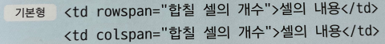
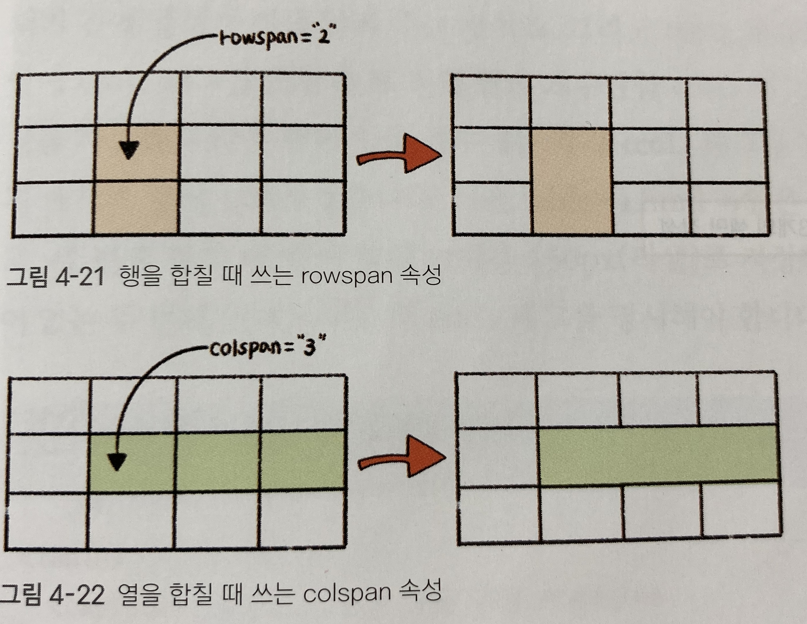
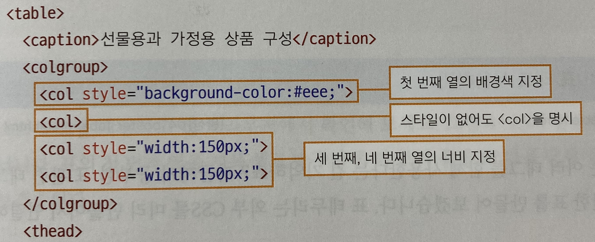
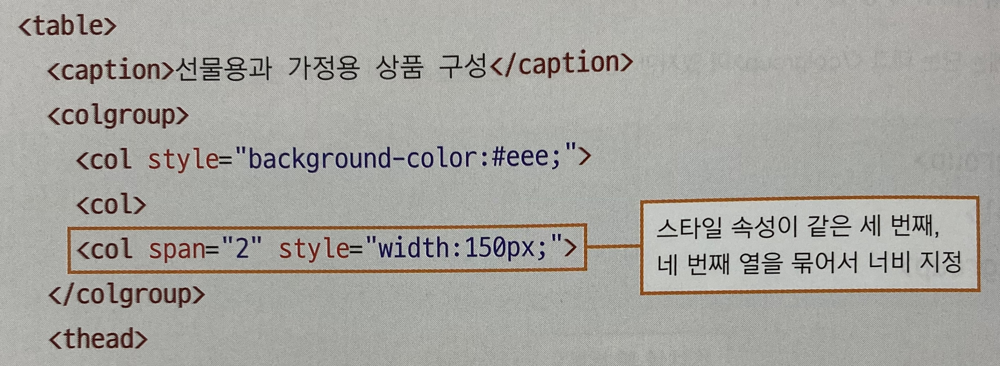

***
## 표의 구조를 지정하는 thead, tbody, tfoot
***
일부 표에서는 제목이 표시된 셀과 자료가 표시된 셀 외에 

표 아래쪽에 합계나 요약 내용을 표기하기도 한다

이런 표는 <b>제목</b>과 <b>본문</b> 그리고 <b>요약</b>이 있는 부분으로 표의 구조를 나누어 놓는 것이 좋다

***
표의 구조를 지정하면 시각 장애인도 화면 낭독기를 통해 표를 쉽게 이해할 수 있다

또한 <b>CSS</b>를 사용해 표의 제목, 본문, 요약에 각각 다른 스타일을 적용할 수도 있다

표의 본문이 길어 한 화면을 넘어갈 경우, 자바스크립트를 이용해 thead와 tfoot태그는 표의 위와 아래에 각각 고정하고

tbody태그만 스크롤 하도록 만들 수 있다 

특히 이 방법은 내용이 긴 표를 여러 장 인쇄할 때도 각 장마다 표의 제목 부분과 요약 부분이 자동으로 인쇄되므로 편리하다

***
***
## 행이나 열을 합치는 rowspan, colspan 속성
***
표는 tr, th td 태그를 이용해서 여러 셀로 구성한다

이때 여러 셀을 합치거나 나누어서 다양한 형태로 바꿀 수 있다

행이나 열을 합치는 것은 실제로는 셀을 합치는 것이므로 td나 th태그에서 이루어진다

<ul>
<li><b>행</b>을 합치려면 <b>rowspan</b> 속성을 사용하고</li>
<li><b>열</b>을 합치려면 <b>colspan</b> 속성을 사용한다</li>
</ul>

### 하지만 결과는 어떤가

행을 합치려면 rowspan인데 세로로 합쳐지고

열을 합치려면 colspan인데 가로로 합쳐진다

행이 가로고 열이 세로인데 말이다

***
## 행과 열, row & column
***

단순히 행은 가로, 열은 세로라고 외우지 말고

- 행은 가로로 놓은 막대기

- 열은 세로로 놓은 막대기

예를 들어보자면

o o o o

o o o o

o o o o

위는 3행 4열이라고 한다

***
***
## 열을 묶어 주는 col, colgroup 태그
***

단순히 표를 만들기만 하는 것이 아니라 특정 열에 배경색을 넣거나 너비를 바꾸려면 원하는 열을 선택할 수 있어야 한다

그럴때 사용하는 태그가 col과 colgroup태그 이다

col은 열을 1개만 지정할 때 사용하고 colgroup태그는 col태그를 2개 이상 묶어서 사용한다

***

colgroup, col태그는 반드시 caption태그 다음에 써야 한다

즉, <b>표의 내용이 시작되기 전에 열의 상태를 알려 주는것</b>이다

그리고 col태그를 사용할 때는 colgroup태그 안에 col태그를 포함해 표 전체 열의 개수만큼 col태그를 넣어야 한다

<b>스타일 속성을 지정하지 않은 열이 있을 경우에도</b> 각각 col태그를 작성해야한다

이때 같은 스타일 속성을 사용하는 col태그가 있다면 두번 반복하지 않고 span 속성을 사용해서 묶어 줄 수 있다

