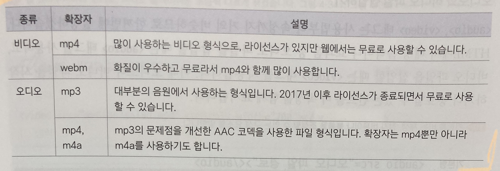
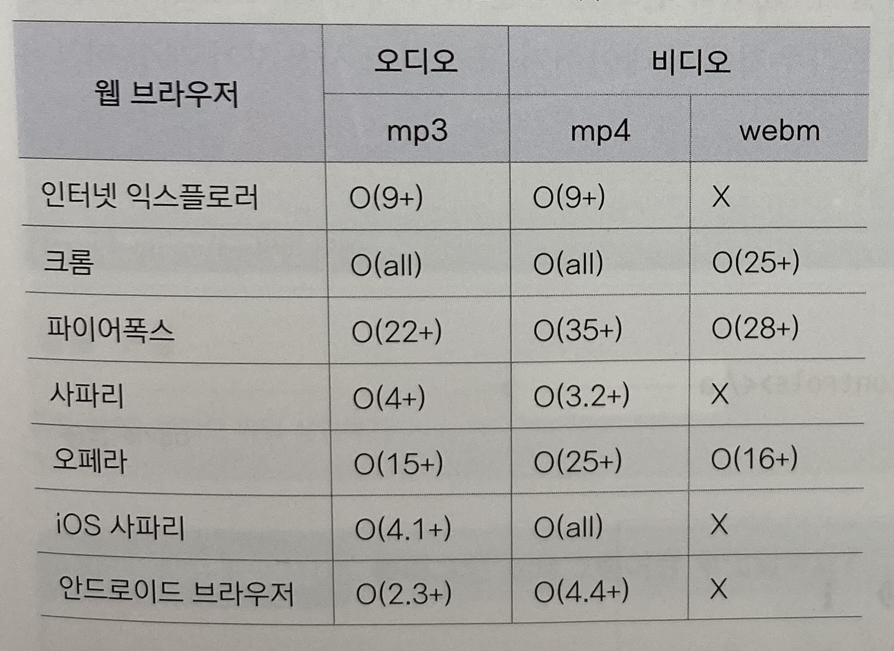

***
## 오디오와 비디오 삽입하기
***
### object태그

object태그는 오디오 파일뿐만 아니라 비디오, 자바 애플릿, PDF 등 다양한 멀티미디어 파일을 삽입할 때 사용한다

웹 문서 안에 다른 문서를 삽입할 때도 사용할 수 있다

기본형 - \<object width="너비" height="길이" data="파일">\</object>

### embed태그

html 초기 버전부터 사용해서 대부분 브라우저에서 사용할 수 있다

기본형 - \<embed src="파일 경로" width="너비" height="길이">

닫는 태그가 없다

embed태그는 오디오,비디오,이미지 등 다양한 멀티미디어 파일을 삽입할 수 있는데 

html의 audio, video, object태그를 지원하지 않는 웹 브라우저를 고려해야 하면 embed태그를 사용해서 멀티미디어 파일을 삽입한다

***
## 웹 브라우저에서 지원하는 멀티미디어 파일의 종류
***

- 멀티미디어 파일의 종류

***

- 웹 브라우저별 오디오, 비디오 파일 지원 여부

***

## 오디오와 비디오 파일을 삽입하는 audio, video태그

***
멀티미디어 파일 관련 태그는 html5 웹 표준이 정해지면서 가장 많이 변한 부분이다

html4까지는 웹 브라우저에 멀티미디어 파일을 삽입한 후에 재생하려면 플러그인 프로그램이 따로 필요했는데

html5로 넘어오면서 웹 브라우저 안에서 멀티미디어 파일을 삽입하고 바로 재생할 수 있게 되었다

근대 이 말인 즉슨 웹 브라우저에서 바로 멀티미디어 파일을 재생하기 때문에 브라우저마다 플레이어가 다르게 된다는 말이기도 하다

같은 웹 브라우저라 하더라도 버전에 따라 지원 상황이 달라질 수 있다

***

### 오디오와 비디오 파일 삽입하기

***

audio와 video태그는 사용법부터 속성까지 거의 비슷하다

오디오 파일을 삽입할때는 audio태그, 비디오 파일을 삽입할 때는 video태그를 사용한다

이때 오디오나 비디오 파일을 시작 하거나 종료할 수 있는 컨트롤 바 속성을 함께 표시한다

오디오 기본형 - \<audio src="오디오 파일 경로" controls>\</audio>

비디오 기본형 - \<video src="비디오 파일 경로" controls width=" ">\</video>

비디오 파일의 경우에는 너빗값을 지정하지 않으면 웹 브라우저에 가득 차게 나타나므로 너빗값을 저적히 지정하는 것이 좋다

***
### 오디오와 비디오 태그의 속성들

|종류|설명|
|----|----|
|controls|플레이어 화면에 컨트롤 바를 표시합니다|
|autoplay|오디오나 비디오를 자동으로 실행합니다|
|loop|오디오나 비디오를 반복 재생합니다|
|muted|오디오나 비디오의 소리를 제거합니다|
|preload|페이지를 불러올 때 오디오나 비디오 파일을 어떻게 로딩할 것인지 지정합니다. 사용할 수 있는 값은 auto, metadata, none입니다. 기본값은 preload="auto"입니다.|
|width, height|비디오 플레이어의 너비와 높이를 지정합니다. width나 height의 값 중에서 하나만 지정할 경우 나머지는 자동으로 계산해서 표시합니다.|
|poster="파일 이름"|\<video>태그에서 사용하는 속성으로 비디오가 재생되기 전까지 화면에 표시될 포스터 이미지를 지정합니다.|

-   오디오 파일을 배경 음악처럼 사용하려면 audio태그에서 autoplay 속성과 loop 속성을 지정하면 된다.
    이때 플레이어가 보이지 않도록 하려면 controls 속성을 빼면 되는데
    대부분의 웹 브라우저에서는 오디오나 소리가 있는 비디오 파일의 자동 재생을 금지하고 있다
    자동 재생을 허용하는 마이크로소프트 엣지에서 확인해보자 
- 비디오 파일도 같은 방법으로 웹 문서에서 자동으로 재생할 수 있다
- 스마트폰이나 태블릿의 웹 브라우저에서는 비디오 파일을 자동 재생할 수 없다
***

