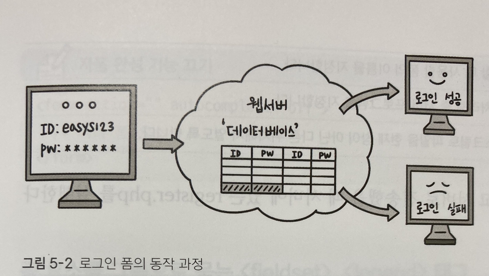

***
# 입력 양식 작성하기
***
## 폼 삽입하기
***
### 웹에서 만나는 폼

사용자가 웹 사이트로 정보를 보낼 수 있는 요소는 모두 <b>폼</b> 이라고 할 수 있다

- 로그인 폼의 동작 과정

폼과 관련한 작업은 정보를 저장하거나 검색, 수정하는 것이 대부분인데 모두 데이터베이스를 기반으로 작동한다

따라서 텍스트 박스나 버튼 같은 폼 형태는 HTML 태그로 만들지만, 폼에 입력한 사용자 정보는 ASP, PHP, JSP 같은 서버 프로그래밍을 이용해 처리한다

***
### 폼을 만드는 form 태그
***
폼 태그의 기본형

    \<form [속성="속성값"]>여러 폼 요소\<form> 

폼 태그의 속성들

|종류|설명|
|----|----|
|name|자바스크립트로 폼을 제어할 때 사용할 폼의 이름을 지정한다|
|action|form태그 안의 내용을 처리해 줄 서버 프로그램을 지정한다|
|target|action 속성에서 지정한 스크립트 파일을 현재 창이 아닌 다른 위치에서 열도록 한다| 
|method|사용자가 입력한 내용을 서버 쪽 프로그램으로 어떻게 넘겨줄 것인지 지정한다. method에서 사용할 수 있는 속성값은 get과 post이다|
- get : 데이터를 256 ~ 4,096byte까지만 서버로 넘길 수 있다. 주소 표시줄에 사용자가 입력한 내용이 그대로 드러나는 단점이 있다
- post : 입력한 내용의 길이에 제한받지 않고 사용자가 입력한 내용도 드러나지 않는다

예를 들어 폼에 내용을 입력하고 서버로 전송했을 때 서버에 있는 register.php를 실행한다면 다음과 같이 작성한다

    <form action="register.php">
        여러 폼 요소들
    </form>

***
### 자동 완성 기능을 나타내는 autocomplete 속성
***
폼에서 내용을 입력할 때 예전에 입력한 내용을 자동으로 표시해 주는 것을 '자동 완성 기능'이라고 한다

사용자가 입력한 내용을 기억했다가 비슷한 글자가 입력되면 이전에 입력한 내용을 힌트로 보여 준다

자동 완성 기능을 autocomplete 속성을 사용하며 기본 속성값은 'on'이다

즉, 자동 완성 기능이 기본으로 켜져 있으므로 입력한 적 있는 값을 한두 글자 정도 입력하면 예전에 입력 했던 내용을 자동으로 보여 준다

하지만 매우 중요한 개인 정보나 인증 번호와 같은 일회성 정보를 입력 한다면 이 기능은 사용하지 않는 것이 좋다

다음 소스처럼 form 태그의 autocomplete 속성을 off로 지정하면 자동 완성 기능을 끌 수 있다

    <form action="" autocomplete="off">
        여러 폼 요소
    </form>

***
### 폼 요소를 그룹으로 묶는 fieldset, legend 태그
***

하나의 폼 안에서 여러 구역을 나누어 표시할 때 fieldset 태그를 사용한다

예를 들어 쇼핑몰 사이트에서 주문서를 작성할 때 개인 정보와 배송 정보를 나누어 표시하면 사용자가 입력하기도 편리하고 화면도 깔끔하게 정리할 수 있다

    - 기본형
    <fieldset [속성="속성값"]> </fieldset>

legend태그는 다음과 같이 fieldset 태그로 묶은 그룹에 제목을 붙일 수 있다

    - 기본형
    <fieldset>
        <legend>그룹 이름</legend>
    </fieldset>

***
### 폼 요소에 레이블을 붙이는 label 태그
***

label태그는 input태그와 같은 폼 요소에 레이블을 붙일 때 사용한다

    !레이블이란?
    입력란 가까이에 아이디나 비밀번호처럼 붙여 놓은 텍스트를 말한다 

label태그를 사용하면 폼 요소와 레이블 텍스트가 서로 연결되었다는 것을 웹 브라우저가 알 수 있다

label태그는 2가지 방법으로 사용할 수 있는데

<b>첫번째 방법</b>은 태그 안에 폼 요소를 넣는 것이다

    - 기본형    
    <label> 레이블명 <input> </label>

<b>두번째 방법</b>은 label태그와 폼 요소를 따로 사용하고 label태그의 for속성과 폼 요소의 id속성을 이용해 서로 연결하는 것이다

다시 말해 폼 요소의 id속성값을 label태그의 for속성에게 알려 주는 방법을 사용한다

    - 기본형
    <label for="id명">레이블명<input id="id명"></label>

"id명"의 값을 똑같이 설정해야 연결된다

이 방법은 첫 번째 방법보다 복잡해 보이지만 label태그를 사용한 레이블과 사용자 정보를 입력받는 input태그가 떨어져 있더라도 둘 사이를 쉽게 연결할 수 있다는 장점이 있다