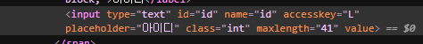
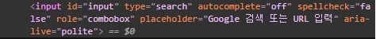

***
## 사용자 입력을 위한 input태그
***
***
### 웹 폼의 다양한 곳에서 사용하는 input태그
***
웹 사이트에서 흔히 볼 수 있는 회원 가입이나 로그인 화면은 폼을 사용해 작성한 것이다

- 네이버의 로그인 아이디 입력 부분

검색 사이트에서 사용하는 검색 창 역시 폼을 이용한 것이다

- 구글의 검색 창 입력 부분

이렇듯 input태그는 다양한 폼에서 사용자가 입력한 정보를 받을 때 사용한다는 것을 잘 기억해 두자

***
### input태그의 type속성
***
|종류|설명|
|----|----|
|text|한 줄짜리 텍스트를 입력할 수 있는 텍스트 박스를 넣습니다|
|password|비밀번호를 입력할 수 있는 필드를 넣습니다|
|search|검색할 때 입력하는 필드를 넣습니다|
|url|URL주소를 입력할 수 있는 필드를 넣습니다|
|email|이메일 주소를 입력할 수 있는 필드를 넣습니다|
|tel|전화번호를 입력할 수 있는 필드를 넣습니다|
|checkbox|주어진 여러 항목에서 2개 이상 선택할 수 있는 체크 박스를 넣습니다|
|radio|주어진 여러 항목에서 1개만 선택할 수 있는 라디오 버튼을 넣습니다|
|number|숫자를 조절할 수 있는 스핀 박스를 넣습니다|
|range|숫자를 조절할 수 있는 슬라이드 막대를 넣습니다|
|date|사용자 지역을 기준으로 날짜(연,월,일)를 넣습니다|
|month|사용자 지역을 기준으로 날짜(연,월)를 넣습니다|
|week|사용자 지역을 기준으로 날짜(연, 주)를 넣습니다|
|time|사용자 지역을 기준으로 시간(시,분,초,분할 초)을 넣습니다|
|datetime|국제 표준시(UTC)로 설정된 날짜와 시간(연,월,일,시,분,초,분할 초)을 넣습니다|
|datetime-local|사용자가 있는 지역을 기준으로 날짜와 시간(연,월,일,시,분,초,분할 초)을 넣습니다|
|submit|전송 버튼을 넣습니다|
|reset|리셋 버튼을 넣습니다|
|image|submit 버튼 대신 사용할 이미지를 넣습니다|
|button|일반 버튼을 넣습니다|
|file|파일을 첨부할 수 있는 버튼을 넣습니다|
|hidden|사용자에게는 보이지 않지만 서버로 넘겨주는 값이 있는 필드를 만듭니다|

***
### 텍스트와 비밀번호를 나타내는 type="text"와 type="password"
***
텍스트 필드는 폼에서 가장 많이 사용하는 요소이다

주로 아이디나 이름, 주소 들 한 줄짜리 일반 텍스트를 입력할 때 사용하는데 비밀번호 필드는 입력하는 내용을

화면에 보여 주지 않아야 하므로 '*'와 같은 특수 문자로 표시한다

이 점만 제외하면 텍스트 필드와 똑같이 동작하고 같은 속성을 사용한다

    - 기본형
    <input type="text">
    <input type="password">

텍스트 필드와 비밀번호 필드에서 사용하는 주요 속성은 다음과 같다

|종류|설명|
|----|----|
|size|텍스트와 비밀번호 필드의 길이를 지정한다. 화면에 몇 글자가 보이도록 할 것인지를 지정한다. 예를 들어 최대로 입력할 수 있는 글자 수가 10개인데 size 속성값을 5로 지정하면 필드 크기는 5개 글자 크기에 맞추고 나머지 5개 글자는 화면에 보이지 않는다|
|value|텍스트 필드 요소가 화면에 표시될 때 텍스트 필드 부분에 보여 주는 내용이다. 이 속성을 사용하지 않으면 빈 텍스트 필드가 표시된다. 비밀번호 필드에서 사용하지 않는 속성이다.|
|maxlength|텍스트 필드와 비밀번호 필드에 입력할 수 있는 최대 문자 수를 지정한다.|

***
### 다양한 용도에 맞게 입력하는 type="search", type="url", type="email", type="tel"
***

텍스트 필드는 한 줄짜리 일반 텍스트를 입력할 수 있다

하지만 폼을 만들다 보면 텍스트 필드를 더 세분해야 할 때가 있다

HTML5에서는 용도에 맞게 입력할 수 있는 텍스트 필드를 다양하게 제공하는데 이 필드들은 텍스트 필드를 기본으로 한다

따라서 텍스트 필드와 거의 같은 속성을 사용한다

<b>type="search"</b>를 사용하면 웹 브라우저 화면으로 볼 때는 텍스트 필드와 똑같지만, 웹 브라우저에서는 검색을 위한 텍스트 필드로 인식한다

이 필드에 검색어를 입력하면 오른쪽에 x가 표시되어 입력한 검색어를 손쉽게 지울 수 있다

<b>type="url"</b>은 웹 주소를 입력하는 필드이고 <b>type="email"</b>는 이메일 주소를 입력하는 필드이다

HTML5에서는 type="email"처럼 이메일 주소 필드로 지정하기만 하면 웹 브라우저가 알아서 확인한다

만일 입력값이 지정한 형식에 맞지 않는다면 웹 브라우저에서 오류 메시지를 보여 준다

<b>type="tel"</b>은 전화번호를 나타내는 필드이다

전화번호는 지역마다 형식이 다르므로 사용자가 입력한 값이 전화번호인지 아닌지 체크할 수 없다

모바일 페이지에서 이 값을 이용하면 바로 전화를 걸 수 있다

텍스트 필드에서 세분화된 필드는 PC용 웹 브라우저에서는 큰 변화가 느껴지지 않는다

하지만 <b>모바일 기기</b>의 웹 브라우저에서 확인하면 이메일 주소를 입력하거나 전화번호를 입력할 때 가상 키보드 배열이 바뀌는 것을 볼 수 있다

***
### 체크 박스와 라디오 버튼을 나타내는 type="checkbox", type="radio"
***

체크박스와 라디오 버튼은 여러 항목 중에서 원하는 항목을 선택할 때 사용하는 폼 요소이다

이때 항목을 1개만 선택하려면 라디오 버튼을 사용하고, 2개 이상 선택하려면 체크 박스를 사용한다

라디오 버튼은 항목을 1개만 선택할 수 있으므로 이미 선택한 항목이 있을 경우 다른 항목을 선택하면 기존 항목은 취소된다

체크 박스는 항목을 2개 이상 선택할 수 있다는 점만 빼면 라디오 버튼 사용법과 비슷하다

    - 기본형 
    <input type="checkbox">
    <input type="radio">

체크 박스와 라디오 버튼에서 사용할 수 있는 속성

|종류|설명|
|----|----|
|value|선택한 체크 박스나 라디오 버튼을 서버에게 알려 줄 때 넘겨줄 값을 지정한다. 이 값은 영문이거나 숫자여야 하며 필수 속성이다|
|checked|체크 박스나 라디오 버튼의 항목은 처음에 아무것도 선택되지 않은 상태로 화면에 표시되는데, 여러 항목 중에서 기본으로 선택해 놓고 싶은 항목에 사용한다. 속성값은 따로 없다.|
***

### 잠깐!

#### 라디오 버튼과 name속성

간혹 HTML 소스 코드를 보면 라디오 버튼에 name속성이 포함된 것을 보 수 있다. 

name속성은 PHP와 같은 웹 프로그래밍에서 폼 요소를 제어할 때 자주 사용한다.

라디오 버튼에서 하나의 버튼만 선택할 수 있게 하려면 모든 라디오 버튼의 name값을 똑같이 지정해야 한다
***

### 숫자 입력 필드를 나타내는 type="number", type="range"

텍스트 필드에서 사용자가 숫자를 직접 입력할 수도 있지만 <b>type="number"</b>를 사용하면 스핀박스가 나타나면서 숫자를 선택할 수 있다

<b>type="range"</b>는 슬라이드 막대를 움직여 숫자를 입력할 수 있다

    - 기본형 
    <input type="number">
    <input type="range">

type="number", type="range"의 속성을 알아보자

|속성|설명|
|----|----|
|min|필드에 입력할 수 있는 최솟값을 지정한다. 기본 최솟값은 0|
|max|필드에 입력할 수 있는 최댓값을 지정한다. 기본 최댓값은 100|
|step|숫자 간격을 지정할 수 있다. 기본값은 1|
|value|필드에 표시할 초깃값|
***

