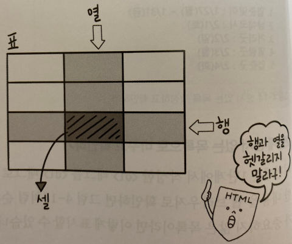

***
## 표 만들기
***

- 표의 구성 요소 살펴보기

표(table)는 행(row)과 열(column) 그리고 셀(cell)로 이루어진다

***
## 표를 만드는 table, caption 태그
***
표의 시작과 끝을 알려 주는 table과 /table태그를 표시하고 그 사이에 표와 관련된 태그를 모두 넣는다

표에 제목을 붙이고 싶다면 table태그 바로 아랫줄에 caption태그를 사용한다

caption태그를 사용하면 제목은 표의 위쪽 중앙에 표시된다

***
## 행을 만드는 tr태그와 셀을 만드는 td, th태그
***

table태그만 작성한다고 표가 만들어 지진 않는다

table태그 안에 행이 몇 개인지, 각 행에는 셀이 몇 개인지 지정해야 한다

tr태그는 행을 만들고 td태그는 행 안에 있는 셀을 만들기 때문에 table태그 안에 tr, td 태그가 모두 모여야 하나의 셀을 만들 수 있다

표의 제목 행에 셀을 만들 때는 td태그 대신 th태그를 사용한다

th태그를 사용한 내용은 진하게 표시되고 셀 안에서 중앙에 배열되므로 눈에 띈다