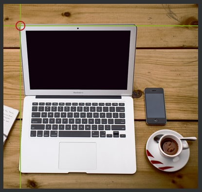
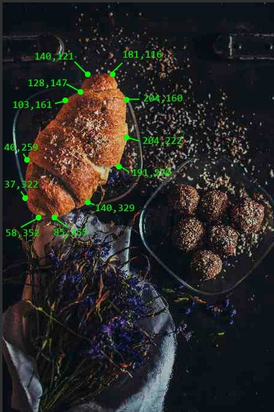

## HTML 이미지 맵
HTML 이미지 맵을 사용하면 이미지에 클릭 가능한 영역을 만들 수 있습니다.

***
### 이미지 맵
HTML \<map>태그는 이미지 맵을 정의합니다. 

이미지 맵은 클릭 가능한 영역이 있는 이미지입니다. 

영역은 하나 이상의 \<area>태그 로 정의됩니다 .

    예시
    위 이미지 맵의 HTML 소스 코드는 다음과 같습니다.

    

    <map name="workmap">
    <area shape="rect" coords="34,44,270,350" alt="Computer" href="computer.htm">
    <area shape="rect" coords="290,172,333,250" alt="Phone" href="phone.htm">
    <area shape="circle" coords="337,300,44" alt="Coffee" href="coffee.htm">
    </map>

***
### 어떻게 작동합니까?
이미지 맵의 기본 개념은 이미지에서 클릭하는 위치에 따라 

다른 작업을 수행할 수 있어야 한다는 것입니다.

이미지 맵을 만들려면 이미지와 클릭 가능한 영역을 설명하는 HTML 코드가 필요합니다.

***
### 이미지
\태그를 사용하여 이미지를 삽입합니다 . 

다른 이미지와의 유일한 차이점은 usemap속성을 추가해야 한다는 것입니다 .

    

usemap값은 해시 태그로 시작 #이미지 맵의 이름 다음에, 

이미지 및 이미지 맵의 관계를 생성하는데 사용된다.

팁: 모든 이미지를 이미지 맵으로 사용할 수 있습니다!

***
### 이미지 맵 생성
그런 다음 \<map>요소를 추가합니다 .

\<map>요소는 이미지 맵을 생성하는데 사용된다.

    <map name="workmap">

name속성은 같은 값이 있어야합니다 \의 usemap속성

***
### area
그런 다음 클릭 가능한 영역을 추가합니다.

클릭 가능한 영역은 \<area>요소를 사용하여 정의됩니다 .

### Shape
클릭 가능한 영역의 모양을 정의해야 하며 다음 값 중 하나를 선택할 수 있습니다.

rect - 직사각형 영역을 정의합니다.
circle - 원형 영역을 정의
poly - 다각형 영역을 정의합니다.
default - 전체 지역을 정의
또한 클릭 가능한 영역을 이미지에 배치할 수 있도록 일부 좌표를 정의해야 합니다. 

***
### Shape="rect"
에 대한 좌표 shape="rect"는 x축에 대한 좌표와 y축에 대한 좌표 가 쌍 으로 제공됩니다.

따라서 좌표 34,44는 왼쪽 여백에서 34픽셀, 위쪽에서 44픽셀에 위치합니다.

좌표 270,350는 왼쪽 여백에서 270픽셀, 위쪽에서 350픽셀 떨어져 있습니다.

이제 클릭 가능한 직사각형 영역을 만들기에 충분한 데이터가 있습니다.

    예시
    <area shape="rect" coords="34, 44, 270, 350" href="computer.htm">

이것은 클릭할 수 있는 영역이며 사용자를 "computer.htm" 페이지로 보냅니다.

***
### Shape="circle"
원 영역을 추가하려면 먼저 원의 중심 좌표를 찾습니다.

그런 다음 원의 반지름을 지정합니다.

이제 클릭 가능한 원형 영역을 만들기에 충분한 데이터가 있습니다.

    예시
    <area shape="circle" coords="337, 300, 44" href="coffee.htm">

이것은 클릭할 수 있는 영역이며 사용자를 "coffee.htm" 페이지로 보냅니다.

***
### Shape="poly"
는 shape="poly"직선 (폴리곤)로 이루어지는 형상을 만들어 여러 점의 좌표를 포함한다.

이것은 모든 모양을 만드는 데 사용할 수 있습니다.

마치 크루아상 모양처럼!

아래 이미지의 크로와상을 클릭 가능한 링크로 만들려면 어떻게 해야 하나요?

***
### shape="poly"

직선 (폴리곤)로 이루어지는 형상을 만들어 여러 점의 좌표를 포함한다.

이것은 모든 모양을 만드는 데 사용할 수 있습니다.

마치 크루아상 모양처럼!

아래 이미지의 크로와상을 클릭 가능한 링크로 만들려면 어떻게 해야 하나요?

크루아상의 모든 모서리에 대한 x 및 y 좌표를 찾아야 합니다.

좌표는 쌍으로 제공됩니다. 하나는 x축용이고 다른 하나는 y축용입니다.

    예시
    <area shape="poly" coords="140,121,181,116,204,160,204,222,191,270,140,329,85,355,58,352,37,322,40,259,103,161,128,147" href="croissant.htm">

***
### 이미지 맵 및 자바스크립트
클릭 가능한 영역은 JavaScript 기능을 트리거할 수도 있습니다.

요소에 click이벤트를 추가하여 \<area>JavaScript 기능을 실행합니다.

여기서는 onclick 속성을 사용하여 영역을 클릭할 때 JavaScript 기능을 실행합니다.

    예시
    <map name="workmap">
    <area shape="circle" coords="337,300,44" href="coffee.htm" onclick="myFunction()">
    </map>

    