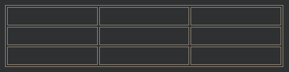
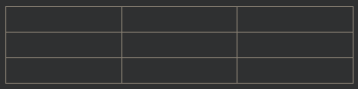
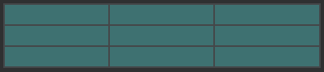
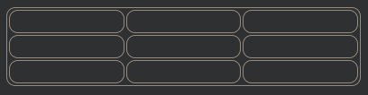
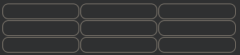

## HTML 표 테두리
HTML 표에는 다양한 스타일과 모양의 테두리가 있을 수 있습니다.

테두리를 추가하는 방법
표에 테두리를 추가하면 각 표 셀 주위에도 테두리가 추가됩니다.

테두리를 추가 CSS의 사용 border에 속성을 table, th및 td요소

  예시
  table, th, td {
    border: 1px solid black;
  }

***
### 접힌 테이블 테두리
위의 예와 같이 이중 테두리가 발생하지 않도록 하려면 CSS border-collapse 속성을 collapse로 설정하십시오 

이렇게 하면 테두리가 단일 테두리로 축소됩니다.

  예시
  table, th, td {
    border: 1px solid black;
    border-collapse: collapse;
  }

  ***
  ### 스타일 테이블 테두리
각 셀의 배경색을 설정하고 테두리에 흰색(문서 배경과 동일)을 지정하면 보이지 않는 테두리의 느낌을 받게 됩니다.

  예시
  table, th, td {
    border: 1px solid white;
    border-collapse: collapse;
  }
  th, td {
    background-color: #96D4D4;
  }

  ***
  ### 원형 테이블 테두리
border-radius으로, 테두리가 모서리가 둥글어 집니다.

  예시
  table, th, td {
    border: 1px solid black;
    border-radius: 10px;
  }

tableCSS 선택기를 생략하여 테이블 주위의 테두리를 건너뜁니다 .

  예시
  th, td {
    border: 1px solid black;
    border-radius: 10px;
  }