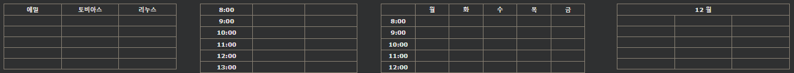
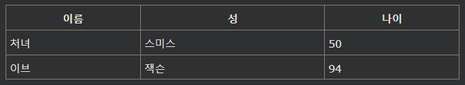
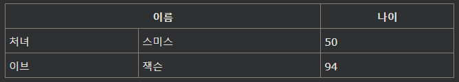
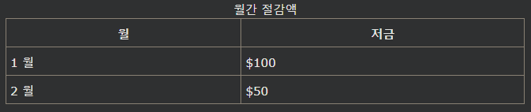

## HTML 테이블 헤더
HTML 테이블에는 각 열이나 행 또는 여러 열/행에 대한 헤더가 있을 수 있습니다.

***
### HTML 테이블 헤더
테이블 헤더는 th요소 로 정의되며 각 th요소는 테이블 셀을 나타냅니다.

[예시](./W3_HTML_day12-4-1.html)

***
### 수직 테이블 헤더
첫 번째 열을 테이블 머리글로 사용하려면 각 행의 첫 번째 셀을 th요소 로 정의합니다.

[예시](./W3_HTML_day12-4-2.html)

***
### 테이블 머리글 정렬
기본적으로 테이블 헤더는 굵게 표시되며 가운데에 표시됩니다.

테이블 헤더를 왼쪽 정렬하려면 CSS text-align속성을 사용하십시오 .

    예시
    th {
    text-align: left;
    }

***
### 여러 열에 대한 헤더
두 개 이상의 열에 걸쳐 있는 헤더를 가질 수 있습니다.

이렇게 하려면 <th> 요소 의 colspan속성을 사용합니다.

[예시](./W3_HTML_day12-4-3.html)

***
### 표 캡션
전체 테이블의 머리글 역할을 하는 캡션을 추가할 수 있습니다.

표에 캡션을 추가하려면 다음 \<caption>태그를 사용하세요 .

[예시](./W3_HTML_day12-4-4.html)

참고 :\<caption> 태그는 \<table>태그 바로 뒤에 삽입 합니다.