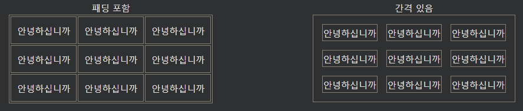

## HTML 표 패딩 및 간격
HTML 표는 셀 내부의 패딩과 셀 사이의 공간을 조정할 수 있습니다.

***
### HTML 테이블 - 셀 패딩
셀 패딩은 셀 가장자리와 셀 내용 사이의 공간입니다.

기본적으로 패딩은 0으로 설정됩니다.

표 셀에 패딩을 추가하려면 CSS padding속성을 사용하십시오 .

    예시
    th, td {
    padding: 15px;
    }

콘텐츠 위에만 패딩을 추가하려면 padding-top속성을 사용하세요 .

그리고 다른 측면은 padding-bottom, padding-left및 padding-right 프로퍼티를 사용합니다.

    예시
    th, td {
    padding-top: 10px;
    padding-bottom: 20px;
    padding-left: 30px;
    padding-right: 40px;
    }

***
### HTML 표 - 셀 간격
셀 간격은 각 셀 사이의 간격입니다.

기본적으로 공간은 2픽셀로 설정됩니다.

표 셀 사이의 공간을 변경하려면 table 요소의 CSS border-space속성을 사용하십시오.

예시
table {
  border-spacing: 30px;
}