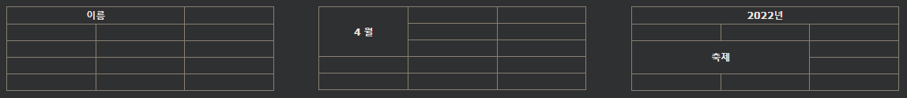

## HTML 테이블 Colspan 및 Rowspan

HTML 테이블에는 여러 행 및/또는 열에 걸쳐 있는 셀이 있을 수 있습니다.

***
### HTML 테이블 - Colspan
여러 열에 걸쳐 셀을 만들려면 다음 colspan속성을 사용하십시오 .

[예시](./W3_HTML_day12-6-1.html)

참고:colspan 속성 값은 확장할 열 수를 나타냅니다.

***
### HTML 테이블 - Rowspan
여러 행에 걸쳐 셀을 만들려면 다음 rowspan속성을 사용하십시오 .

[예시](./W3_HTML_day12-6-2.html)

참고:rowspan 속성 값은 확장할 행 수를 나타냅니다.