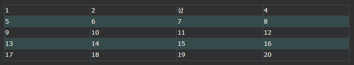
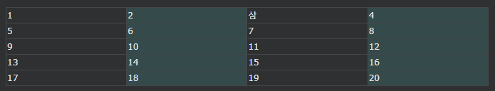
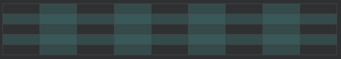
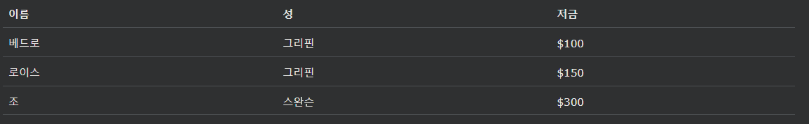
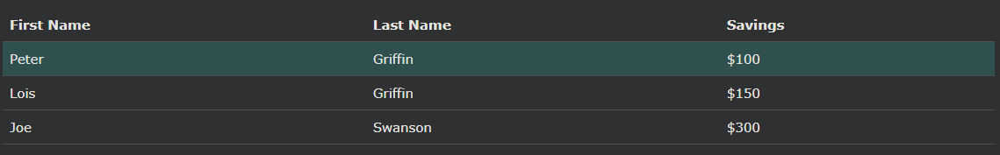

## HTML 테이블 스타일링
CSS를 사용하여 표를 더 멋지게 만드십시오.

### HTML Table - Zebra Stripes

다른 모든 테이블 행에 배경색을 추가하면 멋진 얼룩말 줄무늬 효과를 얻을 수 있습니다.

다른 모든 테이블 행 요소의 스타일을 지정하려면 :nth-child(even) 다음과 같이 선택기를 사용하십시오 .

    예시
    tr:nth-child(even) {
    background-color: #D6EEEE;
    }

참고:(even)대신 (odd)을 사용하면 행 2,4,6... 대신 행 1,3,5...에서 스타일 지정이 발생합니다.

***
### HTML Table - Vertical Zebra Stripes

세로 얼룩말 줄무늬를 만들려면 행이 아닌 다른 열 마다 스타일을 지정합니다 .

다음 :nth-child(even)과 같이 테이블 데이터 요소에 대해 설정합니다 .

    예시
    td:nth-child(even), th:nth-child(even) {
    background-color: #D6EEEE;
    }

참고: 머리글과 일반 표 셀 모두에 스타일을 지정 하려면 :nth-child()선택기를 th및 td요소 모두에 두십시오 .

***
### 세로 및 가로 얼룩말 줄무늬 결합

위의 두 가지 예에서 보았듯이 스타일을 결합할 수 있으며 다른 모든 행과 다른 모든 열에 줄무늬가 생깁니다.

투명한 색상을 사용하면 겹치는 효과를 얻을 수 있습니다.

rgba()색상을 사용하여 색상의 투명도를 지정합니다.

    예시
    tr:nth-child(even) {
    background-color: rgba(150, 212, 212, 0.4);
    }

    th:nth-child(even),td:nth-child(even) {
    background-color: rgba(150, 212, 212, 0.4);
    }

***
### 수평 디바이더

각 표 행의 맨 아래에만 테두리를 지정하면 가로 구분선이 있는 표가 됩니다.

수평 구분선을 얻으려면 border-bottom모든 tr요소에 속성을 추가하십시오 .

    예시
    tr {
    border-bottom: 1px solid #ddd;
    }

***
### 호버블 테이블
tr 태그에 :hover 선택기를 사용하여 마우스 오버 시 테이블 행을 강조 표시합니다.

    예시
    tr:hover {background-color: #D6EEEE;}