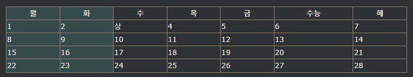

## HTML 테이블 Colgroup
\<colgroup>요소는 테이블의 특정 컬럼에 스타일로 사용된다.

***
### HTML 테이블 Colgroup
테이블의 첫 번째 두 열에 스타일을 지정하려면 \<colgroup> 및 \<col> 요소를 사용합니다 .

\<colgroup>요소는 열 사양에 대한 컨테이너로 사용해야 합니다.

각 그룹은 \<col>요소 로 지정됩니다 .

span속성은 몇개의 열이 스타일을 사용할지 지정합니다.

style속성은 열에 사용할 스타일을 지정합니다.

참고: 그룹별로 CSS 속성 법칙을 매우 제한적으로 선택할 수 있습니다.

    예시
    <table>
    <colgroup>
        <col span="2" style="background-color: #D6EEEE">
    </colgroup>
    <tr>
        <th>MON</th>
        <th>TUE</th>
        <th>WED</th>
        <th>THU</th>
    ...

주 :<colgroup> 태그는 <table> 요소의 하위 태그여야 하며, <head>, <tr>, <td> 등 다른 테이블 요소보다 앞에 배치되어야 하며, <caption> 요소 뒤에 배치되어야 합니다.

***
### Legal CSS Properties

colgroup에서 사용할 수 있는 CSS 속성은 매우 제한적으로 선택되어 있습니다.

width속성
visibility속성
background속성
border속성

다른 모든 CSS 속성은 테이블에 영향을 주지 않습니다.

***
### 여러 열 요소
다른 스타일로 더 많은 열의 스타일을 지정하려면 \<col>내부에 더 많은 요소를 사용 하십시오 \<colgroup>.

    예시
    <table>
    <colgroup>
        <col span="2" style="background-color: #D6EEEE">
        <col span="3" style="background-color: pink">
    </colgroup>
    <tr>
        <th>MON</th>
        <th>TUE</th>
        <th>WED</th>
        <th>THU</th>
    ...

***
### 빈 Colgroups
테이블 중간에 \<col>열의 스타일을 지정하려면 다음 앞에 열에 대해 "빈" 요소(스타일 없음)를 삽입합니다 .

    예시
    <table>
    <colgroup>
        <col span="3">
        <col span="2" style="background-color: pink">
    </colgroup>
    <tr>
        <th>MON</th>
        <th>TUE</th>
        <th>WED</th>
        <th>THU</th>
    ...

***
### 열 숨기기
visibility: collapse속성을 사용하여 열을 숨길 수 있습니다 .

    예시
    <table>
    <colgroup>
        <col span="2">
        <col span="3" style="visibility: collapse">
    </colgroup>
    <tr>
        <th>MON</th>
        <th>TUE</th>
        <th>WED</th>
        <th>THU</th>
    ...