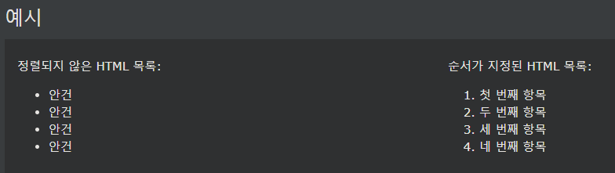

## HTML Lists

HTML 목록을 사용하면 웹 개발자가 목록의 관련 항목 집합을 그룹화할 수 있습니다.

***
### 정렬되지 않은 HTML 목록
순서가 지정되지 않은 목록은 \<ul>태그로 시작합니다 . 

각 목록 항목은 \<li>태그로 시작합니다 .

목록 항목은 기본적으로 글머리 기호(작은 검은색 원)로 표시됩니다.

예시
<ul>
  <li>Coffee</li>
  <li>Tea</li>
  <li>Milk</li>
</ul>

    예시
    <ul>
    <li>Coffee</li>
    <li>Tea</li>
    <li>Milk</li>
    </ul>

***
### 정렬된 HTML 목록
순서가 지정된 목록은 \<ol>태그로 시작합니다 . 

각 목록 항목은 \<li>태그로 시작합니다 .

목록 항목은 기본적으로 숫자로 표시됩니다.

예시
<ol>
  <li>Coffee</li>
  <li>Tea</li>
  <li>Milk</li>
</ol>

    예시
    <ol>
    <li>Coffee</li>
    <li>Tea</li>
    <li>Milk</li>
    </ol>

***
### HTML 설명 목록
HTML은 설명 목록도 지원합니다.

설명 목록은 각 용어에 대한 설명과 함께 용어 목록입니다.

\<dl>태그는 상기 설명 목록을 정의 \<dt>태그는 용어 (이름)를 정의하고, 

\<dd>태그는 각각의 용어를 설명한다.

예시
<dl>
  <dt>Coffee</dt>
  <dd>- black hot drink</dd>
  <dt>Milk</dt>
  <dd>- white cold drink</dd>
</dl>

    예시
    <dl>
    <dt>Coffee</dt>
    <dd>- black hot drink</dd>
    <dt>Milk</dt>
    <dd>- white cold drink</dd>
    </dl>