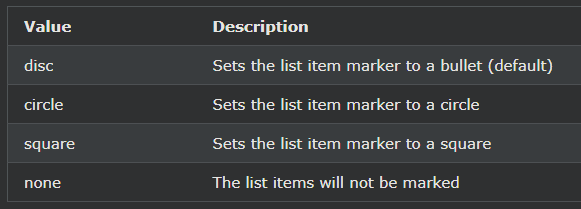

## HTML 순서 없는 목록
HTML \<ul>태그는 정렬되지 않은(글머리 기호) 목록을 정의합니다.

***
### 정렬되지 않은 HTML 목록
순서가 지정되지 않은 목록은 \<ul>태그로 시작합니다 . 

각 목록 항목은 \<li>태그로 시작합니다 .

목록 항목은 기본적으로 글머리 기호(작은 검은색 원)로 표시됩니다.

예시
<ul>
  <li>Coffee</li>
  <li>Tea</li>
  <li>Milk</li>
</ul>

    예시
    <ul>
    <li>Coffee</li>
    <li>Tea</li>
    <li>Milk</li>
    </ul>   

***
### 정렬되지 않은 HTML 목록 - 목록 항목 마커 선택
CSS list-style-type속성은 목록 항목 마커의 스타일을 정의하는 데 사용됩니다. 

다음 값 중 하나를 가질 수 있습니다.

예시 - 디스크
<ul style="list-style-type:disc;">
  <li>Coffee</li>
  <li>Tea</li>
  <li>Milk</li>
</ul>

    예시 - 디스크
    <ul style="list-style-type:disc;">
    <li>Coffee</li>
    <li>Tea</li>
    <li>Milk</li>
    </ul>

***

예시 - 원
<ul style="list-style-type:circle;">
  <li>Coffee</li>
  <li>Tea</li>
  <li>Milk</li>
</ul>

    예시 - 원
    <ul style="list-style-type:circle;">
    <li>Coffee</li>
    <li>Tea</li>
    <li>Milk</li>
    </ul>

***

예시 - 정사각형
<ul style="list-style-type:square;">
  <li>Coffee</li>
  <li>Tea</li>
  <li>Milk</li>
</ul>

    예시 - 정사각형
    <ul style="list-style-type:square;">
    <li>Coffee</li>
    <li>Tea</li>
    <li>Milk</li>
    </ul>

***

예시 - 없음
<ul style="list-style-type:none;">
  <li>Coffee</li>
  <li>Tea</li>
  <li>Milk</li>
</ul>

    예시 - 없음
    <ul style="list-style-type:none;">
    <li>Coffee</li>
    <li>Tea</li>
    <li>Milk</li>
    </ul>

***
### 중첩된 HTML 목록
목록은 중첩될 수 있습니다(목록 내부 목록):

예시
<ul>
  <li>Coffee</li>
  <li>Tea
    <ul>
      <li>Black tea</li>
      <li>Green tea</li>
    </ul>
  </li>
  <li>Milk</li>
</ul>

    예시
    <ul>
    <li>Coffee</li>
    <li>Tea
        <ul>
        <li>Black tea</li>
        <li>Green tea</li>
        </ul>
    </li>
    <li>Milk</li>
    </ul>

참고: 목록 항목(\<li>)에는 새 목록과 이미지 및 링크와 같은 기타 HTML 요소가 포함될 수 있습니다.

***
### CSS가 있는 가로 목록
HTML 목록은 CSS를 사용하여 다양한 방식으로 스타일을 지정할 수 있습니다.

한 가지 인기 있는 방법은 목록을 가로로 스타일 지정하여 탐색 메뉴를 만드는 것입니다.

[예시](./W3_HTML_day13-2.html)
