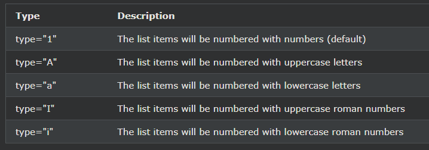

## HTML 순서 목록
HTML \<ol>태그는 정렬된 목록을 정의합니다. 

순서가 지정된 목록은 숫자 또는 알파벳순일 수 있습니다.

***
### 정렬된 HTML 목록
순서가 지정된 목록은 \<ol>태그로 시작합니다 . 

각 목록 항목은 \<li>태그로 시작합니다 .

목록 항목은 기본적으로 숫자로 표시됩니다.

예시
<ol>
  <li>Coffee</li>
  <li>Tea</li>
  <li>Milk</li>
</ol>

    예시
    <ol>
    <li>Coffee</li>
    <li>Tea</li>
    <li>Milk</li>
    </ol>

***
### 정렬된 HTML 목록 - 유형 속성
태그 의 type속성은 \<ol>목록 항목 마커의 유형을 정의합니다.

숫자:
<ol type="1">
  <li>Coffee</li>
  <li>Tea</li>
  <li>Milk</li>
</ol>

    숫자:
    <ol type="1">
    <li>Coffee</li>
    <li>Tea</li>
    <li>Milk</li>
    </ol>

***

대문자:
<ol type="A">
  <li>Coffee</li>
  <li>Tea</li>
  <li>Milk</li>
</ol>

    대문자:
    <ol type="A">
    <li>Coffee</li>
    <li>Tea</li>
    <li>Milk</li>
    </ol>

***

소문자:
<ol type="a">
  <li>Coffee</li>
  <li>Tea</li>
  <li>Milk</li>
</ol>

    소문자:
    <ol type="a">
    <li>Coffee</li>
    <li>Tea</li>
    <li>Milk</li>
    </ol>

***

대문자 로마 숫자:
<ol type="I">
  <li>Coffee</li>
  <li>Tea</li>
  <li>Milk</li>
</ol>

    대문자 로마 숫자:
    <ol type="I">
    <li>Coffee</li>
    <li>Tea</li>
    <li>Milk</li>
    </ol>

***

소문자 로마 숫자:
<ol type="i">
  <li>Coffee</li>
  <li>Tea</li>
  <li>Milk</li>
</ol>

    소문자 로마 숫자:
    <ol type="i">
    <li>Coffee</li>
    <li>Tea</li>
    <li>Milk</li>
    </ol>

***
### 제어 목록 카운팅
기본적으로 순서가 지정된 목록은 1부터 계산을 시작합니다. 

지정된 숫자부터 계산을 시작하려면 다음 start속성을 사용할 수 있습니다 .

예시
<ol start="50">
  <li>Coffee</li>
  <li>Tea</li>
  <li>Milk</li>
</ol>

    예시
    <ol start="50">
    <li>Coffee</li>
    <li>Tea</li>
    <li>Milk</li>
    </ol>

***
### 중첩된 HTML 목록
목록은 중첩될 수 있습니다(목록 내부 목록):

예시
<ol>
  <li>Coffee</li>
  <li>Tea
    <ol>
      <li>Black tea</li>
      <li>Green tea</li>
    </ol>
  </li>
  <li>Milk</li>
</ol>

    예시
    <ol>
    <li>Coffee</li>
    <li>Tea
        <ol>
        <li>Black tea</li>
        <li>Green tea</li>
        </ol>
    </li>
    <li>Milk</li>
    </ol>

참고: 목록 항목(\<li>)에는 새 목록과 이미지 및 링크와 같은 기타 HTML 요소가 포함될 수 있습니다.