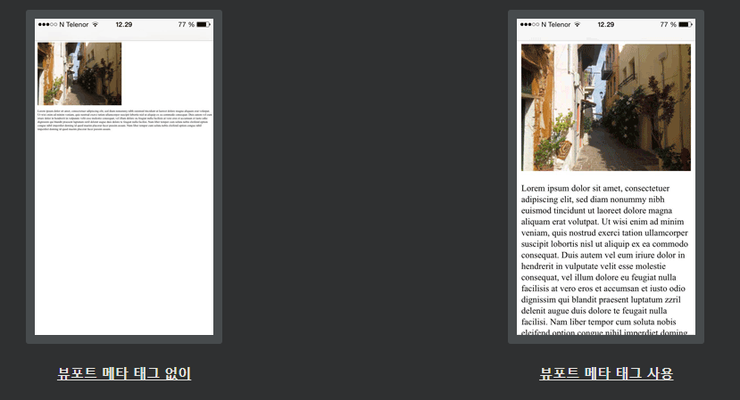

## HTML - 헤드 요소
HTML \<head>요소는 다음과 같은 요소의 컨테이너입니다 

: \<title>, \

***
### HTML \<link> 요소
\<link>요소는 현재 문서 및 외부 자원 사이의 관계를 정의한다. 

\<link>태그는 대부분 외부 스타일 시트에 연결하는 데 사용됩니다.

    예시
    <link rel="stylesheet" href="mystyle.css">

***
### HTML \<meta> 요소
\<meta>요소는 일반적으로 문자 집합, 페이지 설명, 키워드, 문서의 저자, 뷰포트 설정을 지정하는 데 사용됩니다.

메타데이터는 페이지에 표시되지 않지만 브라우저(콘텐츠 표시 또는 페이지 새로고침 방법), 검색 엔진(키워드) 및 기타 웹 서비스에서 사용됩니다.

예시

    사용된 문자 집합을 정의합니다.
    <meta charset="UTF-8">

    검색 엔진에 대한 키워드 정의:
    <meta name="keywords" content="HTML, CSS, JavaScript">

    웹 페이지에 대한 설명을 정의합니다.
    <meta name="description" content="Free Web tutorials">

    페이지 작성자 정의:
    <meta name="author" content="John Doe">

    30초마다 문서 새로 ​​고침:
    <meta http-equiv="refresh" content="30">

    웹사이트가 모든 기기에서 잘 보이도록 표시 영역 설정:
    <meta name="viewport" content="width=device-width, initial-scale=1.0">

    \<meta>태그의 예시

    <meta charset="UTF-8">
    <meta name="description" content="Free Web tutorials">
    <meta name="keywords" content="HTML, CSS, JavaScript">
    <meta name="author" content="John Doe">

***
### 뷰포트 설정
뷰포트는 웹 페이지에서 사용자가 볼 수 있는 영역입니다. 

기기에 따라 다릅니다. 

컴퓨터 화면보다 휴대전화에서 더 작습니다.

\<meta>모든 웹 페이지에 다음 요소를 포함해야 합니다.

    <meta name="viewport" content="width=device-width, initial-scale=1.0">

이것은 페이지의 크기와 배율을 제어하는 ​​방법에 대한 브라우저 지침을 제공합니다.

width=device-width부분은 장치의 화면 폭을 따라 페이지의 폭을 설정한다.(기기에 따라 다름)

initial-scale=1.0부분은 페이지가 처음 브라우저에 의해로드 된 초기 줌 레벨을 설정합니다.

다음은 뷰포트 메타 태그가 없는 웹 페이지와 뷰포트 메타 태그가 있는 동일한 웹 페이지의 예 입니다.

팁: 휴대전화나 태블릿으로 이 페이지를 탐색하는 경우 아래 두 링크를 클릭하여 차이점을 확인할 수 있습니다.

***
### HTML \

***
### HTML \<base> 요소
\<base>요소는 페이지의 모든 상대 URL의 기본 URL 및 / 또는 대상을 지정합니다.

\<base>태그는 HREF 또는 대상 속성 존재 또는 둘 모두를 가져야한다.

문서에는 하나의 단일 \<base> 요소 만 있을 수 있습니다 !

    예시
    페이지의 모든 링크에 대한 기본 URL 및 기본 대상 지정:

    <head>
        <base href="https://www.w3schools.com/" target="_blank">
    </head>

    <body>
        
        <a href="tags/tag_base.asp">HTML base Tag</a>
    </body>