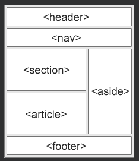

## HTML 레이아웃 요소 및 기술
웹사이트는 종종 잡지나 신문과 같은 여러 열에 콘텐츠를 표시합니다.

[예시](./W3_HTML_day22-1.html)

***
### HTML 레이아웃 요소
HTML에는 웹 페이지의 다른 부분을 정의하는 몇 가지 의미론적 요소가 있습니다.

- \<header> - 문서 또는 섹션의 헤더를 정의합니다.
- \<nav> - 탐색 링크 세트를 정의합니다.
- \<section> - 문서의 섹션을 정의합니다.
- \<article> - 독립적이고 독립적인 콘텐츠를 정의합니다.
- \<aside> - 콘텐츠 이외의 콘텐츠 정의(사이드바 등)
- \<footer> - 문서 또는 섹션의 바닥글을 정의합니다.
- \
 - 사용자가 필요에 따라 열고 닫을 수 있는 추가 세부 정보 정의
- \
 - \
요소 의 제목을 정의합니다.

[HTML 의미론](https://www.w3schools.com/html/html5_semantic_elements.asp)장 에서 의미론적 요소에 대해 자세히 읽을 수 있습니다.

***
### HTML 레이아웃 기법
다중 열 레이아웃을 만드는 네 가지 기술이 있습니다. 각 기술에는 장단점이 있습니다.

- CSS 프레임워크
- CSS 부동 속성
- CSS 플렉스박스
- CSS 그리드

***
### CSS 프레임워크
레이아웃을 빠르게 만들고 싶다면 [W3.CSS](https://www.w3schools.com/w3css/default.asp) 또는 [Bootstrap](https://www.w3schools.com/bootstrap/default.asp) 과 같은 CSS 프레임워크를 사용할 수 있습니다 .

***
### CSS 플로트 레이아웃
CSS float속성을 사용하여 전체 웹 레이아웃을 수행하는 것이 일반적 입니다.

Float은 배우기 쉽습니다.
 
float및 clear속성이 어떻게 작동 하는지 기억하기만 하면 됩니다.
  
단점: 부동 요소는 문서 흐름에 연결되어 유연성에 해를 끼칠 수 있습니다. 
CSS 부동 및 지우기 장 에서 부동에 대해 자세히 알아보십시오.

[예시](./W3_HTML_day22-2.html)

***
### CSS 플렉스박스 레이아웃
flexbox를 사용하면 페이지 레이아웃이 다양한 화면 크기와 다양한 디스플레이 장치를 수용해야 할 때 요소가 예측 가능하게 작동합니다.

[CSS flexbox](https://www.w3schools.com/css/css3_flexbox.asp)

[예시](./W3_HTML_day22-3.html)

***
### CSS 그리드 레이아웃
CSS 그리드 레이아웃 모듈은 행과 열이 있는 그리드 기반 레이아웃 시스템을 제공하므로

부동 소수점과 위치 지정을 사용하지 않고도 웹 페이지를 더 쉽게 디자인할 수 있습니다.

[CSS grid-layout](https://www.w3schools.com/css/css_rwd_grid.asp)