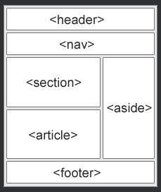

## HTML Semantic Elements

Semantic elements = 의미가 있는 요소.

***
### 시맨틱 요소란?
의미론적 요소는 브라우저와 개발자 모두에게 의미를 명확하게 설명합니다.

의미 없는 요소의 예 : \
및 \- 내용에 대해 아무 것도 알려주지 않습니다.

의미 요소의 예 : \<form>, \<table>및 \<article>- 내용을 명확하게 정의합니다.

***
### HTML의 시맨틱 요소
많은 웹 사이트에는 탐색, 머리글 및 바닥글을 나타내는 
 
 
 와 같은 HTML 코드가 포함되어 있습니다.

HTML에는 웹 페이지의 다른 부분을 정의하는 데 사용할 수 있는 몇 가지 시맨틱 요소가 있습니다.  

    <article>
    <aside>
    

    <figcaption>
    <figure>
    <footer>
    <header>
    <main>
    <mark>
    <nav>
    <section>
    

    <time>

***
### TML \<section> 요소
\<section>요소는 문서의 섹션을 정의합니다.

W3C의 HTML 문서에 따르면 "섹션은 일반적으로 제목이 있는 주제별 콘텐츠 그룹입니다."

\<section>요소를 사용할 수 있는 위치의 예 :

- Chapters
- Introduction
- News items
- Contact information

웹 페이지는 일반적으로 소개, 콘텐츠 및 연락처 정보를 위한 섹션으로 분할될 수 있습니다.

문서의 두 섹션:
예시

<section>
<h1>WWF</h1>

The World Wide Fund for Nature (WWF) is an international organization working on issues regarding the conservation, research and restoration of the environment, formerly named the World Wildlife Fund. WWF was founded in 1961.

</section>

<section>
<h1>WWF's Panda symbol</h1>

The Panda has become the symbol of WWF. The well-known panda logo of WWF originated from a panda named Chi Chi that was transferred from the Beijing Zoo to the London Zoo in the same year of the establishment of WWF.

</section>

    <section>
    <h1>WWF</h1>
    
The World Wide Fund for Nature (WWF) is an international organization working on issues regarding the conservation, research and restoration of the environment, formerly named the World Wildlife Fund. WWF was founded in 1961.

    </section>

    <section>
    <h1>WWF's Panda symbol</h1>
    
The Panda has become the symbol of WWF. The well-known panda logo of WWF originated from a panda named Chi Chi that was transferred from the Beijing Zoo to the London Zoo in the same year of the establishment of WWF.

    </section>

***
### HTML \<article> 요소
\<article>요소는 독립적 인 자체에 포함 된 내용을 지정합니다.

기사는 그 자체로 의미가 있어야 하며 웹 사이트의 나머지 부분과 독립적으로 배포할 수 있어야 합니다.

\<article>요소를 사용할 수 있는 위치의 예 :

- Forum posts
- Blog posts
- User comments
- Product cards
- Newspaper articles

독립적이고 독립적인 콘텐츠가 포함된 세 개의 기사:
예시

<article>
<h2>Google Chrome</h2>

Google Chrome is a web browser developed by Google, released in 2008. Chrome is the world's most popular web browser today!

</article>

<article>
<h2>Mozilla Firefox</h2>

Mozilla Firefox is an open-source web browser developed by Mozilla. Firefox has been the second most popular web browser since January, 2018.

</article>

<article>
<h2>Microsoft Edge</h2>

Microsoft Edge is a web browser developed by Microsoft, released in 2015. Microsoft Edge replaced Internet Explorer.

</article>

    <article>
    <h2>Google Chrome</h2>
    
Google Chrome is a web browser developed by Google, released in 2008. Chrome is the world's most popular web browser today!

    </article>

    <article>
    <h2>Mozilla Firefox</h2>
    
Mozilla Firefox is an open-source web browser developed by Mozilla. Firefox has been the second most popular web browser since January, 2018.

    </article>

    <article>
    <h2>Microsoft Edge</h2>
    
Microsoft Edge is a web browser developed by Microsoft, released in 2015. Microsoft Edge replaced Internet Explorer.

    </article>

CSS를 사용하여 \<article> 요소 스타일 지정:
[실사용 예시](./W3_HTML_day25-1.html)

***
### \<section>에 \<article>을 중첩하거나 그 반대로?
\<article> 요소는 독립적 인 자체에 포함 된 내용을 지정합니다.

\<section>요소는 문서의 섹션을 정의합니다.

정의를 사용하여 해당 요소를 중첩하는 방법을 결정할 수 있습니까? 

안타깝지만 그럴수 없다.

그래서, \<article>요소를 포함하는 \<section>요소 및 \<section>요소를 포함한 \<article>요소의 형식으로 HTML page를 만들어야한다.

***
### HTML <헤더> 요소
\<header>요소는 소개 내용이나 탐색 링크의 집합에 대한 컨테이너를 나타냅니다.

\<header>요소가 일반적으로 포함하는 것:

하나 이상의 제목 요소(\<h1> - \<h6>)
로고 또는 아이콘
저작권 정보

참고: 하나의 HTML 문서에 여러 \<header> 요소 가 있을 수 있습니다. 그러나 \<footer>, \<address>또는 다른 \<header>요소 내에 \<header>요소를 배치 할 수없습니다.

    <article>의 헤더: 
    예시

    <article>
        <header>
            <h1>What Does WWF Do?</h1>
            
WWF's mission:

        </header>
        
WWF's mission is to stop the degradation of our planet's natural environment,
        and build a future in which humans live in harmony with nature.

    </article>

    <article>의 헤더: 
    예시

    <article>
        <header>
            <h1>What Does WWF Do?</h1>
            
WWF's mission:

        </header>
        
WWF's mission is to stop the degradation of our planet's natural environment,
        and build a future in which humans live in harmony with nature.

    </article>

***
### HTML \<footer> 요소
\<footer>요소는 문서 나 구역의 바닥 글을 정의합니다.

\<footer>요소는 일반적으로 포함 :

- 저작권 정보
- 저작권 정보
- 연락처 정보
- 사이트맵
- 맨 위로 링크로 돌아가기
- 관련된 문서

<footer>하나의 문서에 여러 요소 가 있을 수 있습니다 .

    문서의 바닥글 섹션:
    예시

    <footer>
    
Author: Hege Refsnes

    
<a href="mailto:hege@example.com">hege@example.com</a>

    </footer>

***
### HTML \<nav> 요소
\<nav>요소는 탐색 링크의 집합을 정의합니다.

문서의 모든 링크가 \<nav>요소 내부에 있어야 하는 것은 아닙니다. 

\<nav>요소 만 탐색 링크의 주요 블록을위한 것입니다.

장애가 있는 사용자를 위한 화면 판독기와 같은 브라우저는 이 요소를 사용하여 이 콘텐츠의 초기 렌더링을 생략할지 여부를 결정할 수 있습니다.

    탐색 링크 세트:
    예시

    <nav>
        <a href="/html/">HTML</a> |
        <a href="/css/">CSS</a> |
        <a href="/js/">JavaScript</a> |
        <a href="/jquery/">jQuery</a>
    </nav>

***
### HTML \<aside> 요소
\<aside>요소는 side bar 등에 저장되는 내용을 제외하고 어떤 콘텐츠를 정의한다.

\<aside>콘텐츠는 간접적으로 주위의 내용과 관련되어야한다.

    예시
    배치된 콘텐츠 외에 일부 콘텐츠를 표시합니다.

    
My family and I visited The Epcot center this summer. The weather was nice, and Epcot was amazing! I had a great summer together with my family!

    <aside>
        <h4>Epcot Center</h4>
        
Epcot is a theme park at Walt Disney World Resort featuring exciting attractions, international pavilions, award-winning fireworks and seasonal special events.

    </aside>

CSS를 사용하여 \<aside> 요소 스타일 지정:[실사용 예시](./W3_HTML_day25-2.html)

***
### HTML \<Figure> 및 \<figcaption> 요소
\<figure>태그는 그림, 도표, 사진, 코드 목록 등과 같은 태그를 자체에 포함 된 한다.

\<figcaption>태그는 대한 캡션을 정의하는 \<figure>요소입니다. 

\<figcaption>요소는 처음 또는 마지막 자식요소로 \<figure>태그에 배치 될 수 있다.

\요소는 실제 이미지, 그림을 정의한다. 

    예시
    <figure>
        
        <figcaption>Fig1. - Trulli, Puglia, Italy.</figcaption>
    </figure>

***
### 왜 시맨틱 요소인가?
W3C에 따르면 시맨틱 웹을 사용하면 애플리케이션, 기업 및 커뮤니티에서 데이터를 공유하고 재사용할 수 있습니다.

***
사용 가능한 모든 HTML 태그의 전체 목록을 보려면 [HTML 태그 참조](https://www.w3schools.com/tags/default.asp)를 방문하십시오.