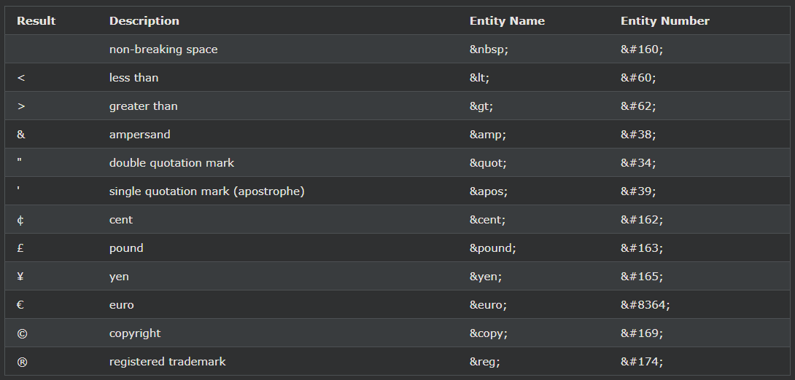
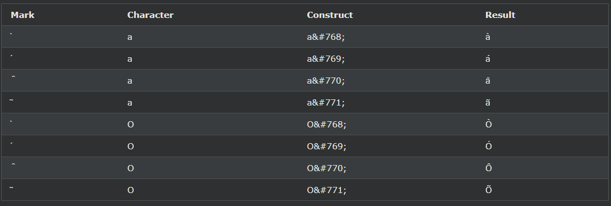

## HTML 엔티티
HTML의 예약 문자는 문자 엔터티로 대체되어야 합니다.

***
### HTML 엔티티
일부 문자는 HTML에 예약되어 있습니다.

텍스트에 보다 작음(<) 또는 보다 큼(>) 기호를 사용하는 경우 브라우저에서 태그와 혼합할 수 있습니다.

문자 엔터티는 HTML에서 예약된 문자를 표시하는 데 사용됩니다.

캐릭터 엔티티는 다음과 같습니다.

    &entity_name;

    OR

    &#entity_number;

보다 작음 기호(<)를 표시하려면 다음 과 같이 작성해야 합니다. \&lt; or \&#60;

엔티티 이름 사용의 장점: 엔티티 이름은 기억하기 쉽습니다.

엔티티 이름 사용의 단점: 브라우저는 모든 엔티티 이름을 지원하지 않을 수 있지만 엔티티 번호에 대한 지원은 좋습니다.

***
### Non-breaking Space
HTML에서 일반적으로 사용되는 엔터티는 줄 바꿈하지 않는 공백입니다. 

    &nbsp;

줄 바꿈하지 않는 공백은 새 줄로 나누지 않는 공백입니다.

줄 바꿈하지 않는 공백으로 구분된 두 단어는 함께 붙습니다(새 줄로 나누지 않음). 

이것은 단어를 깨는 것이 방해가 될 수 있을 때 편리합니다.

    예:

    § 10
    10km/h
    오후 10시

줄 바꿈하지 않는 공백의 또 다른 일반적인 용도는 브라우저가 HTML 페이지에서 공백을 자르는 것을 방지하는 것입니다.

텍스트에 10개의 공백을 쓰면 브라우저는 그 중 9개를 제거합니다. 

텍스트에 실제 공백을 추가하려면 \&nbsp; 캐릭터 엔티티.

팁: 줄 바꿈하지 않는 하이픈(\&#8209;)은 줄 바꿈하지 않는 하이픈 문자(‑)를 정의하는 데 사용됩니다.

***
### 몇 가지 유용한 HTML 문자 엔터티

참고: 엔티티 이름은 대소문자를 구분합니다.

***
### 분음 부호 결합
발음 구별 기호는 문자에 추가된 "상형 문자"입니다.

억음( ̀) 및 예음( ́)과 같은 일부 발음 구별 기호를 액센트라고 합니다.

분음 부호는 문자 위와 아래, 문자 내부 및 두 문자 사이에 나타날 수 있습니다.

분음 부호는 영숫자 문자와 함께 사용하여 페이지에 사용된 문자 집합(인코딩)에 없는 문자를 생성할 수 있습니다.

여기 몇 가지 예가 있어요.

