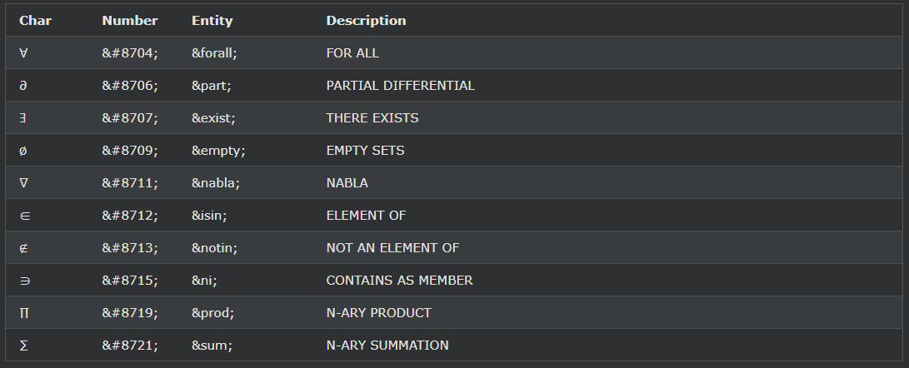
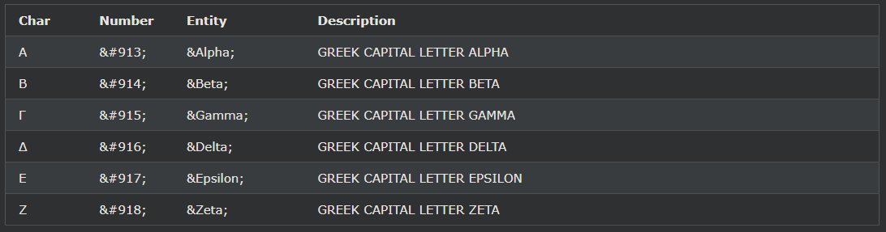
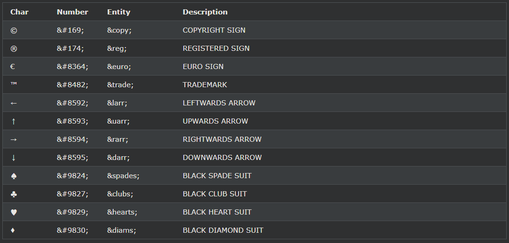

## HTML 기호
키보드에 없는 기호는 엔터티를 사용하여 추가할 수도 있습니다.

***
### HTML 기호 엔티티
HTML 엔터티는 이전 장에서 설명했습니다.

많은 수학, 기술 및 통화 기호는 일반 키보드에 없습니다.

HTML 페이지에 이러한 기호를 추가하려면 기호에 대한 엔티티 이름 또는 엔티티 번호(10진수 또는 16진수 참조)를 사용할 수 있습니다.

엔티티 이름, 10진수 및 16진수 값과 함께 유로 기호(€)를 표시합니다.

예시

    
I will display &euro;

    
I will display &#8364;

    
I will display &#x20AC;

다음과 같이 표시됩니다.

    € 표시
    하겠습니다 € 표시 하겠습니다 € 표시
    하겠습니다

***
### HTML에서 지원하는 일부 수학 기호

[전체 수학 기호](https://www.w3schools.com/charsets/ref_utf_math.asp)

***
### HTML에서 지원하는 일부 그리스 문자

[전체 그리스어 참조](https://www.w3schools.com/charsets/ref_utf_greek.asp)

***
### HTML에서 지원하는 기타 엔터티

[전체 통화 참조](https://www.w3schools.com/charsets/ref_utf_currency.asp)

[전체 화살표 참조](https://www.w3schools.com/charsets/ref_utf_arrows.asp)

[전체 기호 참조](https://www.w3schools.com/charsets/ref_utf_symbols.asp)