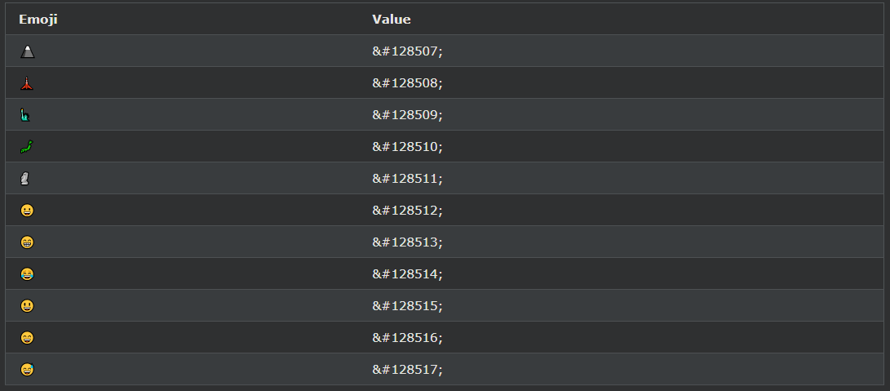

## HTML에서 이모티콘 사용
이모티콘은 UTF-8 문자 집합의 문자입니다. 😄 😍 💗

***
### 이모티콘이란 무엇입니까?
그림 이모티콘은 이미지나 아이콘처럼 보이지만 그렇지 않습니다.

UTF-8(유니코드) 문자 집합의 문자(문자)입니다.

UTF-8은 세계의 거의 모든 문자와 기호를 포함합니다.

***
### HTML 문자 집합 속성
HTML 페이지를 올바르게 표시하려면 웹 브라우저가 페이지에 사용된 문자 집합을 알아야 합니다.

이것은 \<meta>태그에 지정되어 있습니다 .

    <meta charset="UTF-8">

지정하지 않으면 UTF-8이 HTML의 기본 문자 집합입니다.

***
### UTF-8 문자
많은 UTF-8 문자는 키보드로 입력할 수 없지만 항상 숫자(엔티티 번호라고 함)를 사용하여 표시할 수 있습니다.

- A는 65
- B는 66
- C는 67

        예시

        <!DOCTYPE html>
        <html>
        <head>
        <meta charset="UTF-8">
        </head>
        <body>

        
I will display A B C

        
I will display &#65; &#66; &#67;

        </body>
        </html>

예시 설명
\<meta charset="UTF-8">요소는 문자 집합을 정의합니다.

문자 A, B, C는 숫자 65, 66, 67로 표시됩니다.

브라우저가 문자를 표시하고 있음을 이해하도록 하려면 엔티티 번호를 &#으로 시작하고 ; (세미콜론)으로 끝맺는다.

***
### 이모티콘 문자
이모티콘은 UTF-8 알파벳의 문자이기도 합니다.

😄은 128516
😍는 128525입니다
💗은 128151

    예시
    <!DOCTYPE html>
    <html>
    <head>
    <meta charset="UTF-8">
    </head>
    <body>

    <h1>My First Emoji</h1>

    
&#128512;

    </body>
    </html>

사용예
<!DOCTYPE html>
<html>
<head>
<meta charset="UTF-8">
</head>
<body>

<h1>My First Emoji</h1>

&#128512;

</body>
</html>

Emojis는 문자이기 때문에 HTML의 다른 문자와 마찬가지로 복사, 표시 및 크기 조정이 가능합니다.

    예시
    <!DOCTYPE html>
    <html>
    <head>
    <meta charset="UTF-8">
    </head>
    <body>

    <h1>Sized Emojis</h1>

    

    &#128512; &#128516; &#128525; &#128151;
    

    </body>
    </html>

사용예
<!DOCTYPE html>
<html>
<head>
<meta charset="UTF-8">
</head>
<body>

<h1>Sized Emojis</h1>

&#128512; &#128516; &#128525; &#128151;

</body>
</html>

***
### UTF-8의 일부 이모티콘 기호

[HTML Emoji Reference](https://www.w3schools.com/charsets/ref_emoji.asp)