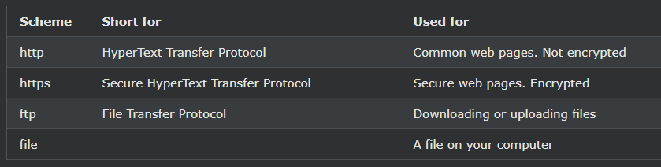

## HTML Uniform Resource Locators(URL)

URL은 웹 주소의 다른 단어입니다.

URL은 단어(예: w3schools.com) 또는 인터넷 프로토콜(IP) 주소(예: 192.68.20.50)로 구성될 수 있습니다.

이름은 숫자보다 기억하기 쉽기 때문에 대부분의 사람들은 서핑할 때 이름을 입력합니다.

***
### URL - 통일 리소스 로케이터
웹 브라우저는 URL을 사용하여 웹 서버에서 페이지를 요청합니다.

URL(Uniform Resource Locator)은 웹에서 문서(또는 기타 데이터)의 주소를 지정하는 데 사용됩니다.

https://www.w3schools.com/html/default.asp 와 같은 웹 주소는 다음 구문 규칙을 따릅니다.

    scheme://prefix.domain:port/path/filename

설명:

- 체계 - 인터넷 서비스 유형 을 정의합니다 (가장 일반적으로 http 또는 https).
- 접두사 - 도메인 접두사를 정의 합니다 (http의 기본값은 www 임).
- 도메인 - 인터넷 도메인 이름을 정의합니다 (예: w3schools.com).
- 포트 - 호스트 의 포트 번호 를 정의합니다 (http의 기본값은 80 ).
- 경로 - 서버 의 경로 를 정의 합니다(생략된 경우: 사이트의 루트 디렉터리).
- 파일 이름 - 문서 또는 리소스의 이름을 정의합니다.

***
### 일반적인 URL 체계
아래 표에는 몇 가지 일반적인 구성표가 나와 있습니다.

***
### URL 인코딩
URL은 [ASCII 문자 집합](https://www.w3schools.com/charsets/ref_html_ascii.asp)을 사용하여 인터넷을 통해서만 보낼 수 있습니다 . URL에 ASCII 집합 이외의 문자가 포함되어 있으면 URL을 변환해야 합니다.

URL 인코딩은 ASCII가 아닌 문자를 인터넷을 통해 전송할 수 있는 형식으로 변환합니다.

URL 인코딩은 ASCII가 아닌 문자를 16진수가 뒤따르는 "%"로 바꿉니다.

URL은 공백을 포함할 수 없습니다. URL 인코딩은 일반적으로 공백을 더하기(+) 기호 또는 %20으로 바꿉니다.

***
### ASCII 인코딩 예제
브라우저는 페이지에 사용된 문자 집합에 따라 입력을 인코딩합니다.

HTML5의 기본 문자 집합은 UTF-8입니다.

모든 URL 인코딩에 대한 전체 참조를 보려면 [URL 인코딩 참조](https://www.w3schools.com/tags/ref_urlencode.asp)를 방문하십시오.