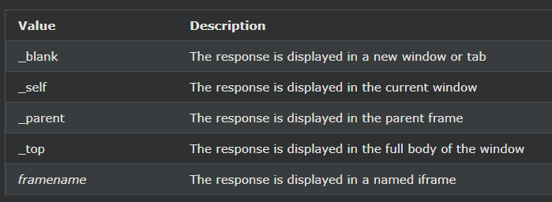

## HTML form 속성
이 장에서는 HTML \<form>요소 의 다양한 속성에 대해 설명합니다 .

***
### action 속성
action속성은 양식이 제출 될 때 작업을 수행 할 정의합니다.

일반적으로 사용자가 제출 버튼을 클릭하면 양식 데이터가 서버의 파일로 전송됩니다.

아래 예에서 양식 데이터는 "action_page.php"라는 파일로 전송됩니다. 

이 파일에는 양식 데이터를 처리하는 서버측 스크립트가 포함되어 있습니다.

예시
제출 시 양식 데이터를 "action_page.php"로 보냅니다.

<form action="/action_page.php">
  <label for="fname">First name:</label> 
  <input type="text" id="fname" name="fname" value="John"> 
  <label for="lname">Last name:</label> 
  <input type="text" id="lname" name="lname" value="Doe">  
  <input type="submit" value="Submit">
</form>

    <form action="/action_page.php">
    <label for="fname">First name:</label> 
    <input type="text" id="fname" name="fname" value="John"> 
    <label for="lname">Last name:</label> 
    <input type="text" id="lname" name="lname" value="Doe">  
    <input type="submit" value="Submit">
    </form>

팁 : action속성이 생략되는 경우, 작업이 현재 페이지로 설정됩니다.

***
### Target 속성

target속성 지정 여기서 양식을 제출하면 수신되는 응답을 표시한다.

target속성은 다음 값 중 하나를 사용할 수 있습니다 :

기본값 _self은 응답이 현재 창에서 열릴 것임을 의미합니다.

    예시
    여기에서 제출된 결과가 새 브라우저 탭에서 열립니다.

    <form action="/action_page.php" target="_blank">

***
### 메소드 속성
method속성은 폼 데이터를 제출할 때 HTTP 메소드가 사용되도록 지정한다.

양식 데이터는 URL 변수( 사용 method="get") 또는 HTTP 포스트 트랜잭션(사용 method="post") 으로 보낼 수 있습니다 .

양식 데이터를 제출할 때 기본 HTTP 메소드는 GET입니다. 

    예시
    이 예에서는 양식 데이터를 제출할 때 GET 메서드를 사용합니다.

    <form action="/action_page.php" method="get">

    예시
    이 예에서는 양식 데이터를 제출할 때 POST 메서드를 사용합니다.

    <form action="/action_page.php" method="post">

GET에 대한 참고 사항:

- 이름/값 쌍으로 양식 데이터를 URL에 추가합니다.
- GET을 사용하여 민감한 데이터를 보내지 마십시오! (제출된 양식 데이터는 URL에서 볼 수 있습니다!)
- URL 길이가 제한됩니다(2048자).
- 사용자가 결과를 책갈피로 지정하려는 양식 제출에 유용합니다.
- GET은 Google의 쿼리 문자열과 같은 비보안 데이터에 유용합니다.

POST에 대한 참고 사항:

- HTTP 요청 본문 안에 양식 데이터를 추가합니다(제출된 양식 데이터는 URL에 표시되지 않음).
- POST는 크기 제한이 없으며 많은 양의 데이터를 보내는 데 사용할 수 있습니다.
- POST가 포함된 양식 제출은 책갈피로 지정할 수 없습니다.

팁: 양식 데이터에 민감한 개인 정보가 포함된 경우 항상 POST를 사용하십시오!

***
### 자동 완성 속성
이 autocomplete속성은 양식에 자동 완성 기능을 설정해야 하는지 여부를 지정합니다.

자동 완성이 켜져 있으면 브라우저는 사용자가 이전에 입력한 값을 기반으로 값을 자동으로 완성합니다.

    예시
    자동 완성 기능이 있는 양식:

    <form action="/action_page.php" autocomplete="on">

***
### 무효화 속성
novalidate속성은 부울 속성입니다.

존재하는 경우 제출 시 양식 데이터(입력)의 유효성을 검사하지 않아야 함을 지정합니다.

    예시
    novalidate 속성이 있는 양식:

    <form action="/action_page.php" novalidate>