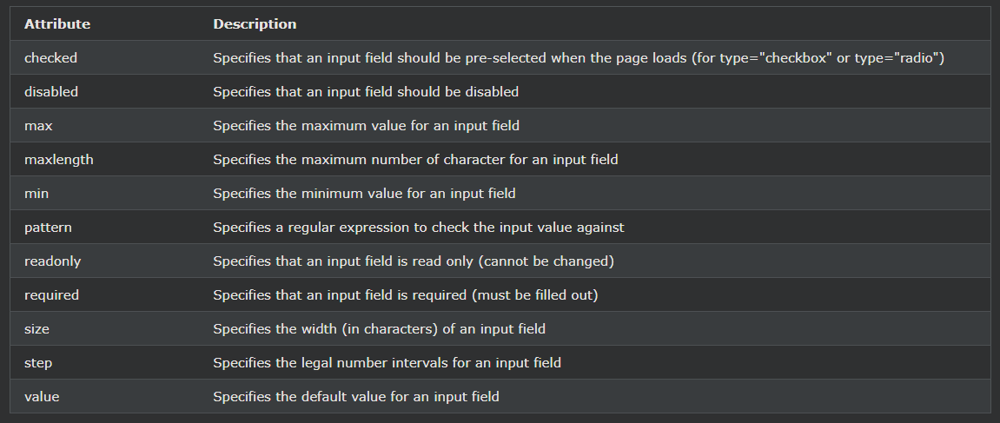

## HTML Input Types

이 장에서는 HTML \<input>요소 의 다양한 유형에 대해 설명합니다 .

***
### HTML 입력 유형
다음은 HTML에서 사용할 수 있는 다양한 입력 유형입니다.

    <input type="button">

<input type="button">

    <input type="checkbox">

<input type="checkbox">

    <input type="color">

<input type="color">

    <input type="date">

<input type="date">

    <input type="datetime-local">

<input type="datetime-local">

    <input type="email">

<input type="email">

    <input type="file">

<input type="file">

    <input type="hidden">

<input type="hidden">

    <input type="image">

<input type="image">

    <input type="month">

<input type="month">

    <input type="number">

<input type="number">

    <input type="password">

<input type="password">

    <input type="radio">

<input type="radio">

    <input type="range">

<input type="range">

    <input type="reset">

<input type="reset">

    <input type="search">

<input type="search">

    <input type="submit">

<input type="submit">

    <input type="tel">

<input type="tel">

    <input type="text">

<input type="text">

    <input type="time">

<input type="time">

    <input type="url">

<input type="url">

    <input type="week">

<input type="week">

팁:type 속성 의 기본값 은 "텍스트"입니다.

***
### 입력 유형 텍스트
\<input type="text"> 한 줄 텍스트 입력 필드를 정의 합니다 .

    예시
    <form>
    <label for="fname">First name:</label> 
    <input type="text" id="fname" name="fname"> 
    <label for="lname">Last name:</label> 
    <input type="text" id="lname" name="lname">
    </form>

<form>
<label for="fname">First name:</label> 
<input type="text" id="fname" name="fname"> 
<label for="lname">Last name:</label> 
<input type="text" id="lname" name="lname">
</form>

***
### 입력 유형 암호
\<input type="password">비밀번호 필드를 정의 합니다 .

    예시
    <form>
    <label for="username">Username:</label> 
    <input type="text" id="username" name="username"> 
    <label for="pwd">Password:</label> 
    <input type="password" id="pwd" name="pwd">
    </form>

<form>
<label for="username">Username:</label> 
<input type="text" id="username" name="username"> 
<label for="pwd">Password:</label> 
<input type="password" id="pwd" name="pwd">
</form>

암호 필드의 문자는 마스킹됩니다(별표 또는 원으로 표시됨).

***
### 입력 유형 제출
\<input type="submit">양식 처리기에 양식 데이터를 제출 하기 위한 버튼을 정의 합니다 .

양식 처리기는 일반적으로 입력 데이터를 처리하기 위한 스크립트가 있는 서버 페이지입니다.

양식 처리기는 양식의 action 속성에 지정됩니다 .

    예시
    <form action="/action_page.php">
    <label for="fname">First name:</label> 
    <input type="text" id="fname" name="fname" value="John"> 
    <label for="lname">Last name:</label> 
    <input type="text" id="lname" name="lname" value="Doe">  
    <input type="submit" value="Submit">
    </form>

<form action="/action_page.php">
<label for="fname">First name:</label> 
<input type="text" id="fname" name="fname" value="John"> 
<label for="lname">Last name:</label> 
<input type="text" id="lname" name="lname" value="Doe">  
<input type="submit" value="Submit">
</form>

제출 버튼의 값 속성을 생략하면 버튼에 기본 텍스트가 표시됩니다.

    예시
    <form action="/action_page.php">
    <label for="fname">First name:</label> 
    <input type="text" id="fname" name="fname" value="John"> 
    <label for="lname">Last name:</label> 
    <input type="text" id="lname" name="lname" value="Doe">  
    <input type="submit">
    </form>

<form action="/action_page.php">
  <label for="fname">First name:</label> 
  <input type="text" id="fname" name="fname" value="John"> 
  <label for="lname">Last name:</label> 
  <input type="text" id="lname" name="lname" value="Doe">  
  <input type="submit">
</form>

***
### 입력 유형 초기화
\<input type="reset"> 모든 양식 값을 기본값으로 재설정 하는 재설정 버튼 을 정의 합니다.

    예시
    <form action="/action_page.php">
    <label for="fname">First name:</label> 
    <input type="text" id="fname" name="fname" value="John"> 
    <label for="lname">Last name:</label> 
    <input type="text" id="lname" name="lname" value="Doe">  
    <input type="submit" value="Submit">
    <input type="reset">
    </form>

<form action="/action_page.php">
  <label for="fname">First name:</label> 
  <input type="text" id="fname" name="fname" value="John"> 
  <label for="lname">Last name:</label> 
  <input type="text" id="lname" name="lname" value="Doe">  
  <input type="submit" value="Submit">
  <input type="reset">
</form>

입력 값을 변경한 후 "초기화" 버튼을 클릭하면 양식 데이터가 기본값으로 재설정됩니다.

***
### 입력 유형 라디오
\<input type="radio">라디오 버튼을 정의 합니다 .

라디오 버튼을 사용하면 제한된 수의 선택 항목 중 하나만 선택할 수 있습니다.

    예시
    
Choose your favorite Web language:

    <form>
    <input type="radio" id="html" name="fav_language" value="HTML">
    <label for="html">HTML</label> 
    <input type="radio" id="css" name="fav_language" value="CSS">
    <label for="css">CSS</label> 
    <input type="radio" id="javascript" name="fav_language" value="JavaScript">
    <label for="javascript">JavaScript</label>
    </form>

Choose your favorite Web language:

<form>
  <input type="radio" id="html" name="fav_language" value="HTML">
  <label for="html">HTML</label> 
  <input type="radio" id="css" name="fav_language" value="CSS">
  <label for="css">CSS</label> 
  <input type="radio" id="javascript" name="fav_language" value="JavaScript">
  <label for="javascript">JavaScript</label>
</form>

***
### 입력 유형 확인란
\<input type="checkbox">확인란을 정의합니다 .

확인란을 통해 사용자는 제한된 수의 선택 중에서 ZERO 또는 MORE 옵션을 선택할 수 있습니다.

    예시
    <form>
    <input type="checkbox" id="vehicle1" name="vehicle1" value="Bike">
    <label for="vehicle1"> I have a bike</label> 
    <input type="checkbox" id="vehicle2" name="vehicle2" value="Car">
    <label for="vehicle2"> I have a car</label> 
    <input type="checkbox" id="vehicle3" name="vehicle3" value="Boat">
    <label for="vehicle3"> I have a boat</label>
    </form>

<form>
  <input type="checkbox" id="vehicle1" name="vehicle1" value="Bike">
  <label for="vehicle1"> I have a bike</label> 
  <input type="checkbox" id="vehicle2" name="vehicle2" value="Car">
  <label for="vehicle2"> I have a car</label> 
  <input type="checkbox" id="vehicle3" name="vehicle3" value="Boat">
  <label for="vehicle3"> I have a boat</label>
</form>

***
### 입력 유형 버튼
\<input type="button">버튼을 정의 합니다 :

    예시
    <input type="button" onclick="alert('Hello World!')" value="Click Me!">

<input type="button" onclick="alert('Hello World!')" value="Click Me!">

***
### 입력 유형 색상
은 \<input type="color">색상을 포함해야 입력 필드에 사용된다.

브라우저 지원에 따라 색상 선택기가 입력 필드에 나타날 수 있습니다.

    예시
    <form>
    <label for="favcolor">Select your favorite color:</label>
    <input type="color" id="favcolor" name="favcolor">
    </form>

<form>
  <label for="favcolor">Select your favorite color:</label>
  <input type="color" id="favcolor" name="favcolor">
</form>

***
### 입력 유형 날짜
은 <input type="date">날짜를 포함해야합니다 입력 필드에 사용됩니다.

브라우저 지원에 따라 날짜 선택기가 입력 필드에 나타날 수 있습니다.

    예시
    <form>
    <label for="birthday">Birthday:</label>
    <input type="date" id="birthday" name="birthday">
    </form>

<form>
  <label for="birthday">Birthday:</label>
  <input type="date" id="birthday" name="birthday">
</form>

min및 max속성을 사용하여 날짜에 제한을 추가 할 수도 있습니다 .

    예시
    <form>
    <label for="datemax">Enter a date before 1980-01-01:</label>
    <input type="date" id="datemax" name="datemax" max="1979-12-31">  
    <label for="datemin">Enter a date after 2000-01-01:</label>
    <input type="date" id="datemin" name="datemin" min="2000-01-02">
    </form>

<form>
  <label for="datemax">Enter a date before 1980-01-01:</label>
  <input type="date" id="datemax" name="datemax" max="1979-12-31">  
  <label for="datemin">Enter a date after 2000-01-01:</label>
  <input type="date" id="datemin" name="datemin" min="2000-01-02">
</form>

***
### 입력 유형 날짜/시간-로컬
\<input type="datetime-local">은 시간대가 없는 날짜 및 시간 입력 필드를 지정합니다.

브라우저 지원에 따라 날짜 선택기가 입력 필드에 나타날 수 있습니다.

    예시
    <form>
    <label for="birthdaytime">Birthday (date and time):</label>
    <input type="datetime-local" id="birthdaytime" name="birthdaytime">
    </form>

<form>
  <label for="birthdaytime">Birthday (date and time):</label>
  <input type="datetime-local" id="birthdaytime" name="birthdaytime">
</form>

***
### 입력 유형 이메일
\<input type="email">은 전자 메일 주소를 포함해야 하는 입력 필드에 사용됩니다.

브라우저 지원에 따라 제출 시 이메일 주소가 자동으로 검증될 수 있습니다.

일부 스마트폰은 이메일 유형을 인식하고 키보드에 ".com"을 추가하여 이메일 입력과 일치합니다.

    예시
    <form>
    <label for="email">Enter your email:</label>
    <input type="email" id="email" name="email">
    </form>

<form>
  <label for="email">Enter your email:</label>
  <input type="email" id="email" name="email">
</form>

***
### 입력 유형 파일
\<input type="file">은 파일 업로드에 대한 파일 선택 필드와 "Browse" 버튼을 정의합니다.

    예시
    <form>
    <label for="myfile">Select a file:</label>
    <input type="file" id="myfile" name="myfile">
    </form>

<form>
  <label for="myfile">Select a file:</label>
  <input type="file" id="myfile" name="myfile">
</form>

***
### 입력 유형 숨김
\<input type="hidden">은 숨겨진 입력 필드를 정의합니다(사용자가 볼 수 없음).

숨겨진 필드를 사용하면 웹 개발자가 양식을 제출할 때 사용자가 보거나 수정할 수 없는 데이터를 포함할 수 있습니다.

숨겨진 필드는 양식을 제출할 때 업데이트해야 하는 데이터베이스 레코드를 저장하는 경우가 많습니다.

참고: 값은 페이지 콘텐츠에서 사용자에게 표시되지 않지만 브라우저의 개발자 도구 또는 "소스 보기" 기능을 사용하여 볼 수 있고 편집할 수 있습니다. 숨겨진 입력을 보안의 한 형태로 사용하지 마십시오!

    예시
    <form>
    <label for="fname">First name:</label>
    <input type="text" id="fname" name="fname">  
    <input type="hidden" id="custId" name="custId" value="3487">
    <input type="submit" value="Submit">
    </form>

<form>
  <label for="fname">First name:</label>
  <input type="text" id="fname" name="fname">  
  <input type="hidden" id="custId" name="custId" value="3487">
  <input type="submit" value="Submit">
</form>

***
### 입력 유형 월
사용자는 \<input type="month">를 사용하여 월과 연도를 선택할 수 있습니다.

브라우저 지원에 따라 날짜 선택기가 입력 필드에 나타날 수 있습니다.

    예시
    <form>
    <label for="bdaymonth">Birthday (month and year):</label>
    <input type="month" id="bdaymonth" name="bdaymonth">
    </form>

<form>
  <label for="bdaymonth">Birthday (month and year):</label>
  <input type="month" id="bdaymonth" name="bdaymonth">
</form>

***
### 입력 유형 번호
\<input type="number">는 숫자 입력 필드를 정의합니다.

허용되는 번호에 대한 제한을 설정할 수도 있습니다.

다음 예는 1에서 5 사이의 값을 입력할 수 있는 숫자 입력 필드를 표시합니다.

    예시
    <form>
    <label for="quantity">Quantity (between 1 and 5):</label>
    <input type="number" id="quantity" name="quantity" min="1" max="5">
    </form>

<form>
  <label for="quantity">Quantity (between 1 and 5):</label>
  <input type="number" id="quantity" name="quantity" min="1" max="5">
</form>

***
### 입력 제한
다음은 몇 가지 일반적인 입력 제한 목록입니다.

다음 예는 0에서 100 사이의 값을 10단계로 입력할 수 있는 숫자 입력 필드를 표시합니다. 기본값은 30입니다.

    예시
    <form>
    <label for="quantity">Quantity:</label>
    <input type="number" id="quantity" name="quantity" min="0" max="100" step="10" value="30">
    </form>

<form>
  <label for="quantity">Quantity:</label>
  <input type="number" id="quantity" name="quantity" min="0" max="100" step="10" value="30">
</form>

***
### 입력 유형 범위
\<input type="range">는 정확한 값이 중요하지 않은 숫자(예: 슬라이더 컨트롤)를 입력하기 위한 컨트롤을 정의합니다. 

기본 범위는 당신은으로 허용됩니다 어떤 숫자에 제한을 설정할 수 있습니다, 그러나 최소, 최대 및 단계 속성과 함께 허용되는 숫자에 대한 제한을 설정할 수 있습니다.

    예시
    <form>
    <label for="vol">Volume (between 0 and 50):</label>
    <input type="range" id="vol" name="vol" min="0" max="50">
    </form>

<form>
  <label for="vol">Volume (between 0 and 50):</label>
  <input type="range" id="vol" name="vol" min="0" max="50">
</form>

***
### 입력 유형 검색
\<input type="search">는 검색 필드(검색 필드는 일반 텍스트 필드처럼 동작)에 사용됩니다.

    예시
    <form>
    <label for="gsearch">Search Google:</label>
    <input type="search" id="gsearch" name="gsearch">
    </form>

<form>
  <label for="gsearch">Search Google:</label>
  <input type="search" id="gsearch" name="gsearch">
</form>

***
### 입력 유형 전화
\<input type="tel">은 전화 번호를 포함해야 하는 입력 필드에 사용됩니다.

    예시
    <form>
    <label for="phone">Enter your phone number:</label>
    <input type="tel" id="phone" name="phone" pattern="[0-9]{3}-[0-9]{2}-[0-9]{3}">
    </form>

<form>
  <label for="phone">Enter your phone number:</label>
  <input type="tel" id="phone" name="phone" pattern="[0-9]{3}-[0-9]{2}-[0-9]{3}">
</form>

***
### 입력 유형 시간
\<input type="time">을 사용하여 사용자가 시간대를 선택할 수 있습니다(시간대가 없음).

브라우저 지원에 따라 입력 필드에 시간 선택기가 표시될 수 있습니다.

    예시
    <form>
    <label for="appt">Select a time:</label>
    <input type="time" id="appt" name="appt">
    </form>

<form>
  <label for="appt">Select a time:</label>
  <input type="time" id="appt" name="appt">
</form>

***
### 입력 유형 URL
URL 주소를 포함해야 하는 입력 필드에 \<input type="url">을 사용합니다.

브라우저 지원에 따라 url 필드는 제출 시 자동으로 유효성을 검사할 수 있습니다.

일부 스마트폰은 url 유형을 인식하고 url 입력과 일치하도록 키보드에 ".com"을 추가합니다.

    예시
    <form>
    <label for="homepage">Add your homepage:</label>
    <input type="url" id="homepage" name="homepage">
    </form>

<form>
  <label for="homepage">Add your homepage:</label>
  <input type="url" id="homepage" name="homepage">
</form>

***
### 입력 유형 주
사용자는 \<input type="week">를 사용하여 주 및 연도를 선택할 수 있습니다.

브라우저 지원에 따라 날짜 선택기가 입력 필드에 나타날 수 있습니다.

    예시
    <form>
    <label for="week">Select a week:</label>
    <input type="week" id="week" name="week">
    </form>

<form>
  <label for="week">Select a week:</label>
  <input type="week" id="week" name="week">
</form>