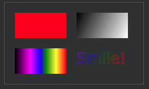
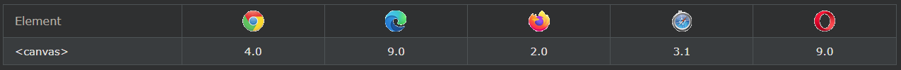

## HTML Canvas Graphics

HTML \<canvas>요소는 웹 페이지에 그래픽을 그리는 데 사용됩니다.

위의 이미지는 \<canvas> 요소를 이용하여 만들어졌습니다.

순서대로 a red rectangle, a gradient rectangle, a multicolor rectangle, and a multicolor text 

***
### HTML 캔버스란 무엇입니까?
HTML \<canvas>요소는 JavaScript를 통해 즉석에서 그래픽을 그리는 데 사용됩니다.

\<canvas>요소는 그래픽 요소만 담겨진 컨테이너입니다. 실제로 그래픽을 그리려면 JavaScript를 사용해야 합니다.

Canvas에는 경로, 상자, 원, 텍스트를 그리고 이미지를 추가하는 여러 가지 메소드들이 있습니다.

***
### 브라우저 지원
표의 숫자는 \<canvas>요소 를 완전히 지원하는 첫 번째 브라우저 버전을 지정합니다 .

***
### 캔버스 예
캔버스는 HTML 페이지의 직사각형 영역입니다. 기본적으로 캔버스에는 테두리와 내용이 없습니다.

마크업은 다음과 같습니다.

    <canvas id="myCanvas" width="200" height="100"></canvas>

참고: 항상 id속성(스크립트에서 참조됨)을 지정 하고 width및 height속성을 지정하여 캔버스 크기를 정의합니다. 테두리를 추가하려면 style속성을 사용하십시오.

    예시
    <canvas id="myCanvas" width="200" height="100" style="border:1px solid #000000;">
    </canvas>

***
### 자바스크립트 추가
사각형의 캔버스 영역을 생성한 후, 드로잉을 하기 위해서는 자바스크립트를 추가해야 합니다.

    선을 그리다
    예시
    

    원 그리기
    예시
    

    텍스트 그리기
    예시
    

    획 텍스트
    예시
    

    선형 그라데이션 그리기
    예시
    

    원형 그라데이션 그리기
    예시
    

    이미지 그리기
    
