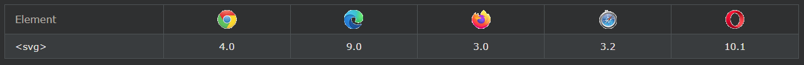

## HTML SVG Graphics

SVG는 XML 형식의 벡터 기반 그래픽을 정의합니다.

***
### SVG 란 무엇입니까?

- SVG는 확장 가능한 벡터 그래픽을 나타냅니다.
- SVG는 웹용 그래픽을 정의하는 데 사용됩니다.
- SVG는 W3C 권장 사항입니다.

***
### HTML \<svg> 요소
HTML \<svg>요소는 SVG 그래픽을 위한 컨테이너입니다.

SVG에는 경로, 상자, 원, 텍스트 및 그래픽 이미지를 그리는 여러 가지 방법이 있습니다.

***
### 브라우저 지원
표의 숫자는 \<svg>요소 를 완전히 지원하는 첫 번째 브라우저 버전을 지정합니다 .

***
### SVG 원

    예시

    <!DOCTYPE html>
    <html>
    <body>

    <svg width="100" height="100">
    <circle cx="50" cy="50" r="40" stroke="green" stroke-width="4" fill="yellow" />
    </svg>

    </body>
    </html>

***
### SVG 직사각형

    예시

    <svg width="400" height="100">
    <rect width="400" height="100" style="fill:rgb(0,0,255);stroke-width:10;stroke:rgb(0,0,0)" />
    </svg>

***
### SVG 둥근 사각형

    예시

    <svg width="400" height="180">
    <rect x="50" y="20" rx="20" ry="20" width="150" height="150"
    style="fill:red;stroke:black;stroke-width:5;opacity:0.5" />
    </svg>

***
### SVG 스타

    예시

    <svg width="300" height="200">
    <polygon points="100,10 40,198 190,78 10,78 160,198"
    style="fill:lime;stroke:purple;stroke-width:5;fill-rule:evenodd;" />
    </svg>

***
### SVG 로고

    예시

    <svg height="130" width="500">
    <defs>
        <linearGradient id="grad1" x1="0%" y1="0%" x2="100%" y2="0%">
        <stop offset="0%" style="stop-color:rgb(255,255,0);stop-opacity:1" />
        <stop offset="100%" style="stop-color:rgb(255,0,0);stop-opacity:1" />
        </linearGradient>
    </defs>
    <ellipse cx="100" cy="70" rx="85" ry="55" fill="url(#grad1)" />
    <text fill="#ffffff" font-size="45" font-family="Verdana" x="50" y="86">SVG</text>
    Sorry, your browser does not support inline SVG.
    </svg>

***
### SVG와 캔버스의 차이점
SVG는 XML에서 2D 그래픽을 설명하기 위한 언어입니다.

Canvas는 JavaScript를 사용하여 즉석에서 2D 그래픽을 그립니다.

SVG는 XML 기반이므로 SVG DOM 내에서 모든 요소를 ​​사용할 수 있습니다. 요소에 대한 JavaScript 이벤트 핸들러를 연결할 수 있습니다.

SVG에서 각각의 그려진 모양은 객체로 기억됩니다. SVG 개체의 속성이 변경되면 브라우저는 자동으로 모양을 다시 렌더링할 수 있습니다.

캔버스는 픽셀 단위로 렌더링됩니다. 캔버스에서 그래픽은 일단 그려지면 브라우저에서 잊어버립니다. 위치를 변경해야 하는 경우 그래픽으로 덮였을 수 있는 개체를 포함하여 전체 장면을 다시 그려야 합니다.