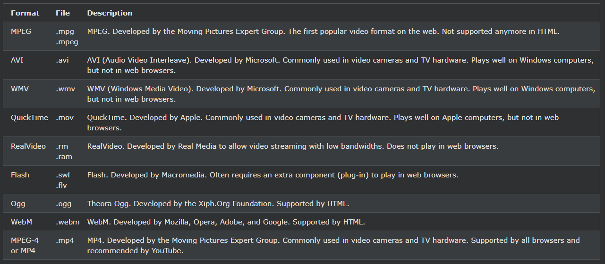
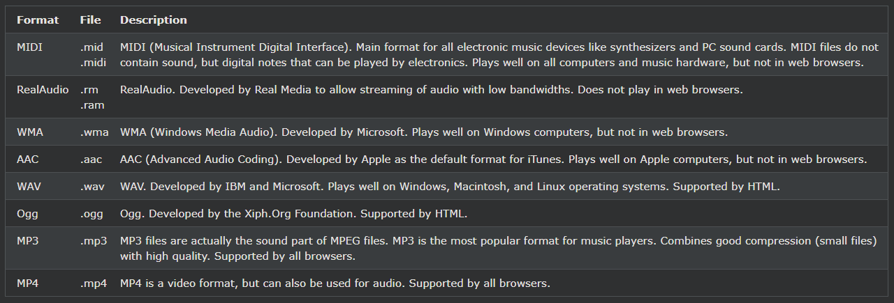

## HTML Multimedia

웹상의 멀티미디어는 사운드, 음악, 비디오, 영화 및 애니메이션입니다.

***
### 멀티미디어란?
멀티미디어는 다양한 형식으로 제공됩니다. 이미지, 음악, 사운드, 비디오, 레코드, 영화, 애니메이션 등과 같이 듣거나 볼 수 있는 거의 모든 것이 될 수 있습니다.

웹 페이지에는 다양한 유형과 형식의 멀티미디어 요소가 포함되어 있는 경우가 많습니다.

***
### 브라우저 지원
최초의 웹 브라우저는 단일 색상의 단일 글꼴로 제한되는 텍스트만 지원했습니다.

나중에 색상, 글꼴, 이미지 및 멀티미디어를 지원하는 브라우저가 등장했습니다!

***
### 멀티미디어 형식
멀티미디어 요소(예: 오디오 또는 비디오)는 미디어 파일에 저장됩니다.

파일 유형을 검색하는 가장 일반적인 방법은 파일 확장자를 확인하는 것입니다.

멀티미디어 파일에는 .wav, .mp3, .mp4, .mpg, .wmv 및 .avi와 같은 형식과 확장자가 있습니다.

***
### 일반적인 비디오 형식
비디오 형식	많은 비디오 형식이 있습니다.

MP4, WebM 및 Ogg 형식은 HTML에서 지원됩니다.

YouTube에서는 MP4 형식을 권장합니다.

참고: MP4, WebM 및 Ogg 비디오만 HTML 표준에서 지원됩니다.

***
### 일반적인 오디오 형식
MP3는 압축된 녹음 음악에 가장 적합한 형식입니다. MP3라는 용어는 디지털 음악과 동의어가 되었습니다.

웹사이트가 녹음된 음악에 관한 것이라면 MP3가 선택입니다.

참고: MP3, WAV 및 Ogg 오디오만 HTML 표준에서 지원됩니다.