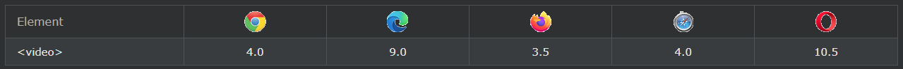
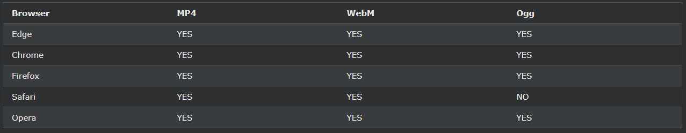
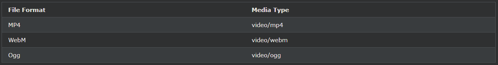

## HTML Video

HTML \<video>요소는 웹 페이지에 비디오를 표시하는 데 사용됩니다.

    <!DOCTYPE html> 
    <html> 
    <body> 

    <video width="400" controls>
    <source src="mov_bbb.mp4" type="video/mp4">
    <source src="./medias/mov_bbb.ogg" type="video/ogg">
    Your browser does not support HTML video.
    </video>

    

    Video courtesy of 
    <a href="http://127.0.0.1:5500/HTML/W3_HTML_day42-1.html" target="_blank">Big Buck Bunny</a>.
    

    </body> 
    </html>

[Big Buck Bunny](./W3_HTML_day42-1.html)

***
### HTML <비디오> 요소
HTML로 비디오를 표시하려면 다음 \<video>요소를 사용하십시오 .

    예시
    <video width="320" height="240" controls>
    <source src="movie.mp4" type="video/mp4">
    <source src="movie.ogg" type="video/ogg">
    Your browser does not support the video tag.
    </video>

***
### 작동 원리
controls속성은 재생, 일시 정지, 볼륨처럼, 비디오 컨트롤을 추가합니다.

항상 width및 height속성을 포함하는 것이 좋습니다 . 높이와 너비가 설정되지 않은 경우 동영상이 로드되는 동안 페이지가 깜박일 수 있습니다.

\<source>요소는 브라우저에서 선택할 수 있습니다 다른 비디오 파일을 지정할 수 있습니다. 브라우저는 처음으로 인식된 형식을 사용합니다.

\<video>와 \</video>태그 사이의 텍스트는 해당 \<video>요소를 지원하지 않는 브라우저에서만 표시됩니다 .

***
### HTML \<video> 자동 재생
비디오를 자동으로 시작하려면 다음 autoplay속성을 사용하십시오 .

    예시
    <video width="320" height="240" autoplay>
    <source src="movie.mp4" type="video/mp4">
    <source src="movie.ogg" type="video/ogg">
    Your browser does not support the video tag.
    </video>

참고: Chromium 브라우저는 대부분의 경우 자동 재생을 허용하지 않습니다. 그러나 음소거된 자동 재생은 항상 허용됩니다.

동영상이 자동으로 재생되도록 하려면 muted뒤에 추가 autoplay하세요(음소거됨).

    예시
    <video width="320" height="240" autoplay muted>
    <source src="movie.mp4" type="video/mp4">
    <source src="movie.ogg" type="video/ogg">
    Your browser does not support the video tag.
    </video>

***
### 브라우저 지원
표의 숫자는 \<video>요소 를 완전히 지원하는 첫 번째 브라우저 버전을 지정합니다 .

\

***
### HTML 비디오 형식
지원되는 비디오 형식은 MP4, WebM 및 Ogg의 세 가지입니다. 다양한 형식에 대한 브라우저 지원은 다음과 같습니다.

\

***
### HTML 비디오 - 미디어 유형

\

***
### HTML 비디오 - 메서드, 속성 및 이벤트
HTML DOM은 \<video>요소에 대한 메서드, 속성 및 이벤트를 정의합니다 .

이를 통해 비디오를 로드, 재생 및 일시 중지하고 재생 시간과 볼륨을 설정할 수 있습니다.

비디오가 재생되기 시작하거나 일시중지될 때 등을 알릴 수 있는 DOM 이벤트도 있습니다.

[Big Buck Bunny](./W3_HTML_day42-2.html)