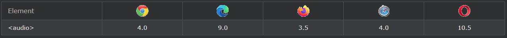
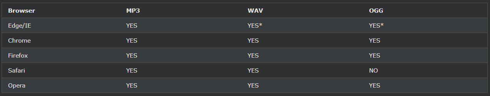
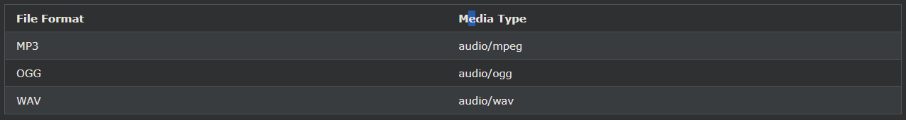

## HTML Audio

HTML \<audio>요소는 웹 페이지에서 오디오 파일을 재생하는 데 사용됩니다.

***
### HTML \<audio> 요소
HTML에서 오디오 파일을 재생하려면 다음 \<audio>요소를 사용하십시오 .

    예시
    <audio controls>
    <source src="horse.ogg" type="audio/ogg">
    <source src="horse.mp3" type="audio/mpeg">
    Your browser does not support the audio element.
    </audio>

***
### HTML 오디오 - 작동 원리
controls속성은 오디오 컨트롤, 같은 재생, 일시 정지 및 볼륨을 추가합니다.

\<source>요소는 브라우저에서 선택할 수 있습니다 다른 오디오 파일을 지정할 수 있습니다. 브라우저는 처음으로 인식된 형식을 사용합니다.

\<audio>와 \</audio>태그 사이의 텍스트는 해당 \<audio>요소를 지원하지 않는 브라우저에서만 표시됩니다 .

***
### HTML \<audio> 자동 재생
오디오 파일을 자동으로 시작하려면 다음 autoplay속성을 사용하십시오 .

    예시
    <audio controls autoplay>
    <source src="horse.ogg" type="audio/ogg">
    <source src="horse.mp3" type="audio/mpeg">
    Your browser does not support the audio element.
    </audio>

참고: Chromium 브라우저는 대부분의 경우 자동 재생을 허용하지 않습니다. 그러나 음소거된 자동 재생은 항상 허용됩니다.

오디오 파일이 자동으로 재생되기 시작하도록(음소거됨) muted뒤에 추가 autoplay:

    예시
    <audio controls autoplay muted>
    <source src="horse.ogg" type="audio/ogg">
    <source src="horse.mp3" type="audio/mpeg">
    Your browser does not support the audio element.
    </audio>

***
### 브라우저 지원
표의 숫자는 \<audio>요소 를 완전히 지원하는 첫 번째 브라우저 버전을 지정합니다 .

***
### HTML 오디오 형식
지원되는 오디오 형식은 MP3, WAV 및 OGG의 세 가지입니다. 다양한 형식에 대한 브라우저 지원은 다음과 같습니다. 

***
### HTML 오디오 - 미디어 유형

***
### HTML 오디오 - 메서드, 속성 및 이벤트
HTML DOM은 \<audio>요소에 대한 메서드, 속성 및 이벤트를 정의합니다 .

이를 통해 오디오를 로드, 재생 및 일시 중지하고 지속 시간과 볼륨을 설정할 수 있습니다.

오디오가 재생되기 시작하거나 일시 중지될 때 등을 알릴 수 있는 DOM 이벤트도 있습니다.

전체 DOM 참조를 보려면 [HTML 오디오/비디오 DOM 참조](https://www.w3schools.com/tags/ref_av_dom.asp)로 이동하십시오 .