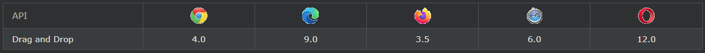

## HTML Drag and Drop API

HTML에서는 모든 요소를 ​​끌어다 놓을 수 있습니다.

***
### drag on drop

드래그 앤 드롭은 매우 일반적인 기능입니다. 개체를 "잡아" 다른 위치로 끌 때입니다.

***
### 브라우저 지원
표의 숫자는 끌어서 놓기를 완전히 지원하는 첫 번째 브라우저 버전을 지정합니다.

***
### HTML 드래그 앤 드롭 예제
아래 예는 간단한 드래그 앤 드롭 예입니다.

    예시
    <!DOCTYPE HTML>
    <html>
        <head>
            
        </head>
        <body>

            

            

        </body>
    </html>

복잡해 보일 수 있지만 끌어서 놓기 이벤트의 모든 다른 부분을 살펴보겠습니다.

***
### 요소를 드래그 가능하게 만들기
우선 요소를 드래그 가능하게 만들려면 draggable속성을 true로 설정하십시오 .

\

***
### 끌 항목 - ondragstart 및 setData()
그런 다음 요소를 끌 때 발생하는 작업을 지정합니다.

위의 예에서 ondragstart속성은 드래그할 데이터를 지정하는 함수 drag(event)를 호출합니다.

이 dataTransfer.setData()메서드는 끌어온 데이터의 데이터 유형과 값을 설정합니다.

    function drag(ev) {
    ev.dataTransfer.setData("text", ev.target.id);
    }

이 경우 데이터 유형은 "텍스트"이고 값은 드래그 가능한 요소의 ID("drag1")입니다.

***
### 드롭 위치 - ondragover
ondragover(가) 데이터를 드래그 이벤트 지정이 제거 될 수있다.

기본적으로 데이터/요소는 다른 요소에 삭제할 수 없습니다. 드롭을 허용하려면 요소의 기본 처리를 방지해야 합니다.

이것은 event.preventDefault()ondragover 이벤트에 대한 메서드를 호출하여 수행됩니다 .

    event.preventDefault()

***
### 드롭 - 온드롭
드래그한 데이터를 드롭하면 드롭 이벤트가 발생합니다.

위의 예에서 ondrop 속성은 함수 drop(event)을 호출합니다.

    function drop(ev) {
        ev.preventDefault();
        var data = ev.dataTransfer.getData("text");
        ev.target.appendChild(document.getElementById(data));
    }

코드 설명:

- 데이터의 브라우저 기본 처리를 방지하려면 preventDefault()를 호출하십시오(기본값은 드롭 시 링크로 열려 있음).
- dataTransfer.getData() 메서드로 드래그한 데이터를 가져옵니다. 이 메서드는 setData() 메서드에서 동일한 유형으로 설정된 모든 데이터를 반환합니다.
- 끌어온 데이터는 끌어온 요소의 ID("drag1")입니다.
- 드래그한 요소를 드롭 요소에 추가