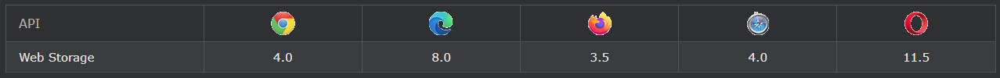

## HTML Web Storage API

HTML web storage; better than cookies.

***
### HTML 웹 스토리지란 무엇입니까?
웹 스토리지를 사용하면 웹 애플리케이션이 사용자의 브라우저 내에서 로컬로 데이터를 저장할 수 있습니다.

HTML5 이전에는 애플리케이션 데이터가 모든 서버 요청에 포함된 쿠키에 저장되어야 했습니다. 웹 저장소는 더 안전하며 웹 사이트 성능에 영향을 주지 않고 많은 양의 데이터를 로컬에 저장할 수 있습니다.

쿠키와 달리 저장 한도가 훨씬 더 크고(최소 5MB) 정보가 서버로 전송되지 않습니다.

웹 저장소는 원본(도메인 및 프로토콜당)별로 제공됩니다. 한 출처의 모든 페이지는 동일한 데이터를 저장하고 액세스할 수 있습니다.

***
### 브라우저 지원
표의 숫자는 Web Storage를 완전히 지원하는 첫 번째 브라우저 버전을 지정합니다.

***
### HTML 웹 스토리지 객체
HTML 웹 스토리지는 클라이언트에 데이터를 저장하기 위한 두 가지 객체를 제공합니다.

- window.localStorage - 만료 날짜 없이 데이터를 저장합니다.
- window.sessionStorage - 한 세션에 대한 데이터를 저장합니다(브라우저 탭을 닫으면 데이터가 손실됨).

웹 저장소를 사용하기 전에 localStorage 및 sessionStorage에 대한 브라우저 지원을 확인하십시오.

    if (typeof(Storage) !== "undefined") {
        // Code for localStorage/sessionStorage.
    } else {
        // Sorry! No Web Storage support..
    }

***
### localStorage 객체
localStorage 객체는 만료 날짜 없이 데이터를 저장합니다. 데이터는 브라우저를 닫아도 삭제되지 않으며 다음 날, 주 또는 연도에 사용할 수 있습니다.

    예시
    // Store
    localStorage.setItem("lastname", "Smith");

    // Retrieve
    document.getElementById("result").innerHTML = localStorage.getItem("lastname");

설명된 예:

- name="lastname" 및 value="Smith"를 사용하여 localStorage 이름/값 쌍을 만듭니다.
- "lastname"의 값을 검색하여 id="result"인 요소에 삽입합니다.

위의 예는 다음과 같이 작성할 수도 있습니다.

    // Store
    localStorage.lastname = "Smith";
    // Retrieve
    document.getElementById("result").innerHTML = localStorage.lastname;

"lastname" localStorage 항목을 제거하는 구문은 다음과 같습니다.

    localStorage.removeItem("lastname");

참고: 이름/값 쌍은 항상 문자열로 저장됩니다. 필요할 때 다른 형식으로 변환하는 것을 잊지 마십시오!

다음 예제에서는 사용자가 버튼을 클릭한 횟수를 계산합니다. 이 코드에서 값 문자열은 카운터를 늘릴 수 있도록 숫자로 변환됩니다.

    예시
    if (localStorage.clickcount) {
        localStorage.clickcount = Number(localStorage.clickcount) + 1;
    } else {
        localStorage.clickcount = 1;
    }
    document.getElementById("result").innerHTML = "You have clicked the button " +
    localStorage.clickcount + " time(s).";

***
### sessionStorage 객체
sessionStorage개체가 로컬 스토리지 오브젝트 같은지, 제외시켰다 단지 하나 개의 세션에 대한 데이터를 저장하고있다. 사용자가 특정 브라우저 탭을 닫으면 데이터가 삭제됩니다.

다음 예는 현재 세션에서 사용자가 버튼을 클릭한 횟수를 계산합니다.

    예시
    if (sessionStorage.clickcount) {
        sessionStorage.clickcount = Number(sessionStorage.clickcount) + 1;
    } else {
        sessionStorage.clickcount = 1;
    }
    document.getElementById("result").innerHTML = "You have clicked the button " +
    sessionStorage.clickcount + " time(s) in this session.";