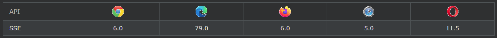
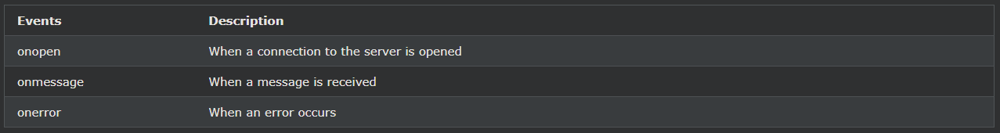

## HTML SSE API
SSE(Server-Sent Events)를 사용하면 웹 페이지가 서버에서 업데이트를 가져올 수 있습니다.

***
### 서버에서 보낸 이벤트 - 단방향 메시징
서버에서 보낸 이벤트는 웹 페이지가 서버에서 자동으로 업데이트를 받는 경우입니다.

이것은 이전에도 가능했지만 웹 페이지에서 사용 가능한 업데이트가 있는지 물어야 합니다. 서버에서 보낸 이벤트를 사용하면 업데이트가 자동으로 제공됩니다.

예: Facebook/Twitter 업데이트, 주가 업데이트, 뉴스 피드, 스포츠 결과 등

***
### 브라우저 지원
표의 숫자는 서버에서 보낸 이벤트를 완전히 지원하는 첫 번째 브라우저 버전을 지정합니다.

***
### 서버에서 보낸 이벤트 알림 수신
EventSource 개체는 서버에서 보낸 이벤트 알림을 수신하는 데 사용됩니다.

    예시
    var source = new EventSource("demo_sse.php");
    source.onmessage = function(event) {
        document.getElementById("result").innerHTML += event.data + " ";
    };

설명된 예:

- 새 EventSource 개체를 만들고 업데이트를 보내는 페이지의 URL을 지정합니다(이 예에서는 "demo_sse.php").
- 업데이트가 수신될 때마다 onmessage 이벤트가 발생합니다.
- onmessage 이벤트가 발생하면 수신된 데이터를 id="result"인 요소에 넣습니다.

***
### 서버 전송 이벤트 지원 확인
위의 tryit 예제에는 서버에서 보낸 이벤트에 대한 브라우저 지원을 확인하기 위한 몇 가지 추가 코드 줄이 있었습니다.

    if(typeof(EventSource) !== "undefined") {
        // Yes! Server-sent events support!
        // Some code.....
    } else {
        // Sorry! No server-sent events support..
    }

***
### 서버 측 코드 예
위의 예가 작동하려면 데이터 업데이트(예: PHP 또는 ASP)를 보낼 수 있는 서버가 필요합니다.

서버측 이벤트 스트림 구문은 간단합니다. "Content-Type" 헤더를 "text/event-stream"으로 설정합니다. 이제 이벤트 스트림 전송을 시작할 수 있습니다.

    PHP 코드(demo_sse.php):

    <?php
    header('Content-Type: text/event-stream');
    header('Cache-Control: no-cache');

    $time = date('r');
    echo "data: The server time is: {$time}\n\n";
    flush();
    ?>

    ASP(VB)의 코드(demo_sse.asp):

    <%
    Response.ContentType = "text/event-stream"
    Response.Expires = -1
    Response.Write("data: The server time is: " & now())
    Response.Flush()
    %>

코드 설명:

- "Content-Type" 헤더를 "text/event-stream"으로 설정합니다.
- 페이지가 캐시되지 않도록 지정
- 보낼 데이터 출력( 항상 "data: "로 시작)
- 출력 데이터를 다시 웹 페이지로 플러시

***
### 이벤트 소스 개체
위의 예에서는 onmessage 이벤트를 사용하여 메시지를 가져왔습니다. 그러나 다른 이벤트도 사용할 수 있습니다.

